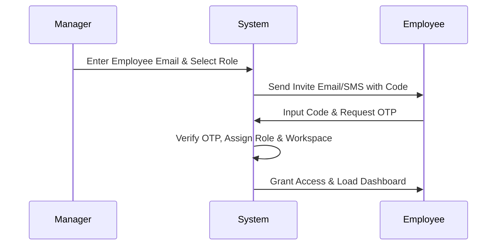
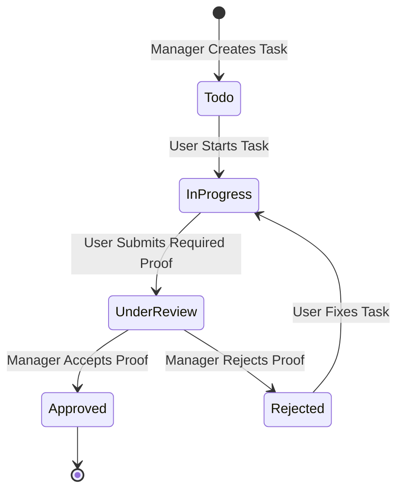
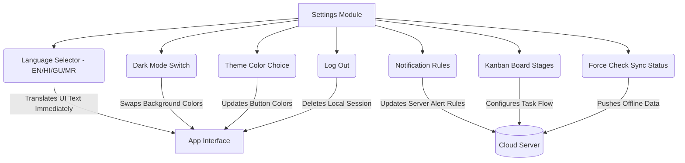

# Business Requirements Document (BRD) - Routine App

## Table of Contents
1. [Executive Summary](#1-executive-summary)
2. [Project Scope & Objectives](#2-project-scope--objectives)
3. [User Roles & Stakeholders](#3-user-roles--stakeholders)
4. [Module: Splash & Authentication](#4-module-splash--authentication)
5. [Module: Workspace & Dashboard](#5-module-workspace--dashboard)
6. [Module: Project & Task Management](#6-module-project--task-management)
7. [Module: Verification & Approvals](#7-module-verification--approvals)
8. [Module: Communication & Omnichannel Input](#8-module-communication--omnichannel-input)
9. [Module: App Settings](#9-module-app-settings)
10. [Non-Functional Requirements & Security](#10-non-functional-requirements--security)
11. [Reporting & Future Roadmap](#11-reporting--future-roadmap)

---

## 1. Executive Summary
Routine is an enterprise task and workflow management system designed to make business operations smooth. Many businesses struggle because they lack visibility into what workers are doing daily, the quality of work is inconsistent, and instructions are lost across different apps like WhatsApp or verbal chats. 

Routine solves this by providing a unified workspace where owners can manage branches, managers can mandate "Proof of Work" (like photos or videos before a task is closed), and teams can chat right next to the task they are working on.

## 2. Project Scope & Objectives
The goal of Routine is to build a web-based and mobile-friendly platform that:
*   Allows one business owner to run multiple isolated workspaces (e.g., different store branches).
*   Enforces Role-Based Access Control (RBAC) so people only see what they need to.
*   Centralizes tasks, chats, and approvals to reduce the number of tools a company uses.
*   Ensures 100% accountability through mandatory "Proof of Work".
*   Provides a **Zero-Friction Input Layer** via WhatsApp and standard phone tools, allowing ground-level workers to interact without needing to learn a huge new software interface.

## 3. User Roles & Stakeholders
*   **Business Owner (Primary User):** Strategic oversight. Creates workspaces, manages billing, and oversees all branches.
*   **Workspace Admin (Secondary User):** Handles user onboarding, configures the settings, and manages the structure of the teams.
*   **Department Manager (Operational User):** Assigns tasks, verifies quality, approves or rejects submissions, and checks reports.
*   **Team Member / Employee (End User):** Executes daily tasks, submits proof of completion (photos/videos), and updates their progress.

---

## 4. Module: Splash & Authentication
**Overview:** This module handles the front door of the application. It secures the platform using OTPs (One-Time Passwords) and invites, making sure that only authorized staff can enter.

**Button Impacts & Actions:**
*   **Register / Accept Invite Button:**
    *   *Why to do it:* To create a new account using an invite code sent by a manager. 
    *   *What happens:* Registers the user in the database, automatically places them into their correct workspace and role, and loads the dashboard.
*   **Log In / Send OTP Button:**
    *   *Why to do it:* To securely enter the application from a mobile device without remembering a password.
    *   *What happens:* The system checks the user's phone or email, issues a secure token, and grants access to the app sessions based on their defined role.

---

## 5. Module: Workspace & Dashboard
**Overview:** The central hub users see after logging in. It aggregates their tasks, notifications, and gives Owners/Admins the ability to swap between different company branches.

**Button Impacts & Actions:**
*   **Switch Workspace Dropdown / Button:**
    *   *Why to do it:* A Business Owner wants to stop looking at "Branch A" and start managing "Branch B".
    *   *What happens:* The system changes the active workspace ID, instantly clearing the screen and re-fetching data (tasks, users, chat) strictly for the newly selected company branch without asking the user to log out and log back in.

---

## 6. Module: Project & Task Management
**Overview:** The core execution module where work is planned and tracked. Users manage Kanban boards (columns like To Do, In Progress, Done), subtasks, and recurring schedules.

**Button Impacts & Actions:**
*   **Create Task Button:**
    *   *Why to do it:* A manager needs to assign a new job (e.g., Clean the lobby) to a team member.
    *   *What happens:* Saves the task details (Priority, Due Date, Assignee) into the database, updates the Kanban board for everyone in real-time, and sends a notification to the assigned worker.
*   **Drag Task Card (Kanban):**
    *   *Why to do it:* To visually update the status of a task from "To Do" to "In Progress".
    *   *What happens:* The system updates the task's status in the database, triggering any built-in automated workflows (e.g., notifying the manager that work has begun).

---

## 7. Module: Verification & Approvals
**Overview:** Ensures that work isn't just marked "done" blindly. If a task requires it, the worker must prove completion, triggering a multi-stage review loop.

**Button Impacts & Actions:**
*   **Upload Proof (Camera/File) Button:**
    *   *Why to do it:* The worker needs to attach a photo showing they restocked a shelf completely.
    *   *What happens:* The image/document is uploaded to secure storage, attached to the task record, and the task status shifts to "Pending/Under Review" once submitted.
*   **Approve Task Button:**
    *   *Why to do it:* The Manager reviews the submitted photo and agrees the job was done correctly.
    *   *What happens:* The task is moved to the finalized "Approved/Done" state. An audit log is permanently created, and the original worker is notified that their work was accepted.
*   **Reject Task Button:**
    *   *Why to do it:* The Manager spots that the shelf was only half-restocked in the photo. 
    *   *What happens:* The Manager inputs a rejection remark. The task is kicked back to "In Progress", and the assigned worker gets an urgent alert detailing what needs fixing.

---

## 8. Module: Communication & Omnichannel Input
**Overview:** Facilitates talking directly inside the app, and also features a "Zero-Friction" layer where managers/staff can create tasks just by sending a WhatsApp message to the Routine AI bot.

**Button Impacts & Actions:**
*   **Send Chat Message Button:**
    *   *Why to do it:* A team member has a question about a specific assignment.
    *   *What happens:* Broadcasts the message over real-time websockets so the recipient sees it instantly on their screen.
*   **Confirm Draft Task (WhatsApp ingestion) Button:**
    *   *Why to do it:* An employee sent a text to the WhatsApp bot: "Restock dairy by 5pm". The AI interpreted it and created a Draft. The user taps confirm to make it an official task.
    *   *What happens:* The draft format is finalized, bound to the database as an active Task, assigned to the correct user, and populated on the Dashboard.
*   **Share to Routine (iOS/Android Share Sheet) Action:**
    *   *Why to do it:* A manager jots down a quick note in their phone's native Notes app and shares it to Routine.
    *   *What happens:* The app opens, creates a Draft using the shared text, and prompts the user to finalize the assignment.

---

## 9. Module: App Settings
**Overview:** The centralized location for user preferences, personalization features, and workspace tuning. This module directly affects how the application looks, feels, and interacts with the user.

**Button Impacts & Actions:**
*   **Language Selector Dropdown:**
    *   *Why to do it:* A field worker is more comfortable reading instructions in their native language to avoid miscommunication.
    *   *What happens:* The user selects a language (Supported: **English, Hindi, Gujarati, Marathi**). The application immediately updates all screen menus, task descriptions, instructions, and buttons to the selected language natively.
*   **Dark Mode Toggle:**
    *   *Why to do it:* To reduce battery consumption on mobile devices and reduce eye strain for employees working night shifts.
    *   *What happens:* Instantly flips the application’s base theme from a light background with dark text to a dark background with light text. 
*   **Theme Color Selection Checkboxes/Chips:**
    *   *Why to do it:* To personalize the application layout, allowing different branches or teams to have their own brand color identity.
    *   *What happens:* The primary color of the app (affecting buttons, active states, and highlights) instantly changes across all menus.
*   **Notifications Settings Toggles:**
    *   *Why to do it:* To avoid being spammed. A user might only want alerts for High Priority notifications or mentions, not every tiny update.
    *   *What happens:* Saves the user's preference to their profile. The server will now respect these rules before sending Push Notifications or automated emails.
*   **Sync Status / Manual Sync Button:**
    *   *Why to do it:* A field worker enters a strong Wi-Fi zone after doing tasks offline in a warehouse and wants to make sure their progress is sent to the cloud.
    *   *What happens:* The app packages all cached offline actions (like newly marked tasks or local photos) and forces a secure background upload to the server. It also pulls down any new tasks.
*   **Kanban Customization Controls:**
    *   *Why to do it:* Different companies process work differently (e.g., adding a "QA Check" or "Waiting on Customer" stage). 
    *   *What happens:* The Admin edits or renames board columns. The server saves this new operational flow, and the updated pipeline is reflected for the whole team instantly across the workspace's task boards.
*   **Log Out Button:**
    *   *Why to do it:* To secure the company's data when stepping away from the device or handing the phone to someone else.
    *   *What happens:* The application securely destroys the user's active session token, clears private cached tasks out of the device's memory, and drops the user back on the initial login screen.

---

## 10. Non-Functional Requirements & Security
**Overview:** Ensure the app is fast, safe, and reliable.
*   **Security:** Every data request relies on JWT-based authentication. Strict Role-Based Access Control filters out data so that a user in Workspace A can never accidentally view data in Workspace B. Data is fully encrypted.
*   **Performance:** Pages must load quickly (under 2 seconds). Chats and task movements happen instantly because of WebSocket connections. The system is designed to support high volume concurrent users per workspace.
*   **Audit Logging:** Every major change to a task or a system rule creates a permanent record showing purely *who* did it and *when*. This provides legal safety, PII protection, and absolute accountability.

## 11. Reporting & Future Roadmap
*   **Activity Reports:** Dedicated screens for Managers displaying Task Completion Rates (percentage of tasks completed vs. assigned), the average time it takes a manager to approve a task, and time tracking reports per project.
*   **Future Expansions:**
    *   *Phase 2:* Smarter AI recognizing bottlenecks automatically and task prioritization.
    *   *Phase 3:* Integrations with external tools (Slack, Google Calendar, Zapier).
    *   *Phase 4:* Expanded offline mode for field workers completely devoid of connectivity.
    *   *Phase 5:* Advanced resource planning and capacity management capabilities.

 

 

 

 

Business Requirements Document (BRD) 

Project Name: Routine (Task Management Platform) 

 

1. Executive Summary 

Routine is a Task Management mobile application that helps businesses manage their daily work. Whether a business is run by one person or by a large team, Routine helps keep work organized, clear, and on schedule.  

Routine can be downloaded and used by any business, and businesses that already use Vasy ERP receive additional benefits. These benefits include better connection with existing business data and clearer visibility into daily operations.  

Today, many businesses struggle to manage daily tasks properly. Important work details are often shared through phone calls, WhatsApp messages, paper notes, or emails. Because of this, tasks are missed, delayed, or completed incorrectly. Managers and owners find it difficult to know what work is done, who completed it, and whether it was done properly.  

Routine solves this problem by bringing all tasks, projects, and team communication into one secure system, so work is captured in a structured way instead of getting lost in WhatsApp chats, notebooks, or verbal instructions. Every worker gets a clear list of what they need to do. Managers can easily assign tasks, track progress, and review completed work without confusion. Routine supports verifiable proof of work, such as images, videos, documents, or notes, and it can check location when required (geofencing). Routine also supports role-based approval workflows, including manual approvals, multi-step approvals, and optional auto-approval rules when configured. A complete history is kept for accountability (who did what, when, and from where), enabling reporting at workspace and user/department levels and supporting compliance and operational review when integrated with Vasy ERP.  

Core Highlights: 

Task Tracking: Everyone knows what work is assigned and when it must be completed.  

Team Roles: The application changes based on a user’s role. Owners, managers, and employees only see what they need to see.  

Smart AI Helper: A built-in AI assistant helps users ask questions and complete daily work faster.  

Omnichannel Input: Tasks can be captured from WhatsApp and by sharing Notes text into Routine, and they stay Draft until confirmed.  

Clear Reports: Business leaders can easily see progress, performance, and work completion at any time. 

Routine is designed to be successful by keeping daily work clear, organized, and easy to track. By using Routine, businesses can reduce mistakes, save time, and maintain better control over daily work, with stronger teamwork and accountability.  

The target platform for the mobile application is Flutter (iOS & Android). The backend technology stack (API framework, database, real-time transport, hosting, and storage) is to be finalised (TBD) during the technical design phase. The architecture must support offline-first mobile sync, real-time updates, secure multi-tenant isolation, proof media storage, and the WhatsApp + AI Draft → Confirm ingestion flow. 

 

2. Business Requirement Summary 

To achieve the goals outlined in the executive summary, Routine must fulfill the following high-level business capabilities: 

1. Centralized Workspace & Team Structure 

Provide secure, isolated workspaces for different businesses. 

Support dynamic team structures where employees can belong to a primary department and multiple additional departments. 

Enforce strict Role-Based Access Control (RBAC) consisting of Owners, Admins, Managers, and Employees to govern data visibility and action permissions. 

2. Comprehensive Task & Project Execution 

Enable the creation of Projects complete with customizable Kanban boards for tracking progress. 

Facilitate task creation with rich details (Title, Description, Priority, Due Date, Assignees tracking multiple departments). 

Support hierarchical task breakdown using subtasks to manage complex deliverables accurately. 

3. Verifiable Proof of Work & Accountability 

Mandate proof submissions (photos, videos, documents, or text notes) for designated tasks before they can be marked as completed. 

Implement Geofencing to enforce location-based check-ins, ensuring field tasks are performed at the correct physical locations. 

Provide optional time tracking capabilities, allowing users to start, pause, and stop timers, or manually log tracked hours spent on specific tasks. 

4. Approval Workflows & Quality Control 

Route sensitive or critical tasks through an approval pipeline ("Pending Approval" state). 

Allow Managers and Admins to review submitted proofs, logged hours, and task details before final sign-off (Approve or Reject). 

5. Omnichannel Ingestion & AI Automation 

Equip the platform to receive task inputs from external channels, specifically WhatsApp and native device "Notes" sharing. 

Stage external inputs in a user-specific "Drafts" inbox, clearly distinguishing sources by channel, to prevent workspace clutter. 

Utilize Artificial Intelligence (AI) to automatically parse natural language from drafts to pre-fill task details. 

Provide an embedded AI assistant (Chatbot) to help users query their pending work, summarize project statuses, and streamline daily planning. 

6. Analytics, Audit, & Integration 

Provide comprehensive Dashboards and Reports for business leaders to track performance, task burndown, and bottlenecks. 

Maintain an immutable Audit Log of critical actions (e.g., user deletion, permission changes, task deletions) to ensure compliance. 

Enable seamless integration with ERP setups (such as Vasy ERP) to synchronize employee directories and operational triggers. 

 

3. Problem Analysis 

3.1 The Visibility Black Hole 

Problem: Owners of multi-branch stores or distributed teams cannot monitor real-time floor operations. They receive verbal updates hours after the fact. Routine Answer: A role-specific live dashboard with task completion rates, proof media feeds, and overdue alerts updated in real-time.  

3.2 The Input Friction Black Hole 

Problem: Floor staff are too busy to open a complex app and fill a multi-field form to report a broken fixture or request a restock. Routine Answer: Omnichannel Input — staff send a voice note or text to Routine via WhatsApp or Native Notes. AI parses the natural language, creates a structured draft task, and asks for a one-tap confirmation.  

3.3 The Quality Inconsistency Black Hole 

Problem: Standards are inconsistent shift to shift because "done" is subjective without evidence. Routine Answer: Configurable Proof of Work. Each task or template can require proof (image, video, document, or notes) before it can be submitted for approval or marked complete.  

3.4 The Sequential Work Failure 

Problem: A staff member notifies a customer that their special order has arrived before verifying the stock was actually received, causing embarrassment. Routine Answer: Task Dependencies. Tasks can be sequenced where a downstream task is blocked at the system level until its predecessor is marked Done.  

3.5 The Accountability Gap 

Problem: When something goes wrong (expired product on shelf, incorrect price tag), there is no record of who did what and when. Routine Answer: Immutable Audit Logs. Every create, update, delete, approve, and reject action is recorded with user ID, timestamp, and a before/after snapshot. 

3.6 The "Out of Bounds" Verification Gap 

Problem: Field employees or delivery staff claim to be on-site, but managers have no easy way to independently verify their actual location without micromanaging. Routine Answer: Geofencing Execution. Routine uses GPS boundaries, ensuring users must be physically present within a specific radius of the job site before the system permits them to complete location-sensitive tasks. 

3.7 The Approval Bottleneck 

Problem: Critical decisions or sensitive tasks get stalled because managers miss requests buried in long email threads or chaotic WhatsApp groups. Routine Answer: Dedicated Approval Workflows. Tasks requiring sign-off skip straight to a focused "Approvals" dashboard, sending immediate push notifications and maintaining a clear status of "Pending Approval" until a manager signs off. 

 

4. Solution Overview 

Routine solves operational gaps by providing a structured, closed-loop task management ecosystem. The solution acts as a central hub where inputs from multiple channels converge into actionable items, are executed under strict verification rules, and culminate in a permanent audit trail. 

4.1 The Core Loop 

The heart of the Routine application is the Core Execution Loop. This ensures no task is lost, no standard is bypassed, and accountability is maintained from end to end: 

Ingestion & Capture: Work is captured natively in the app or via external channels (WhatsApp, OS share menus). AI structures the raw data into a "Draft". 

Refinement & Assignment: The user reviews the draft, sets parameters (subtasks, required proof, geofence rules), and confirms it as an active "To-Do". 

Execution & Verification: The assignee begins work, optionally tracking time. To complete the task, they must pass Geofence constraints (if set) and submit Proof of Work (media/documents). 

Review & Approval: The task enters a "Pending Approval" state where authorized managers review the submitted proof. 

Completion & Audit: Upon approval, the task is marked "Completed," updating real-time dashboards and logging the entire chain of custody to the immutable audit trail. 

4.2 High-Level Architecture Flow 

graph TD 
   subgraph Inputs [Omnichannel Inputs] 
       WA["WhatsApp Integration"] 
       Notes["Native Device Share"] 
       Voice["In-App Voice/Text"] 
   end 
   subgraph AI_Layer [AI Processing Layer] 
       Parser["NLP Context & Data Extraction"] 
   end 
   subgraph Routine_Core [Routine Application Core] 
       Drafts["Drafts Inbox"] 
       Tasks["Task & Project Engine"] 
       Approvals["Approval & Verification"] 
       Dashboards["Role-Based Dashboards"] 
   end 
   subgraph Storage [Persistent Storage] 
       DB[("Primary Relational DB")] 
       Media["Secure Proof Media Storage"] 
   end 
   WA -->|"Raw Text/Media"| Parser 
   Notes -->|"Shared Text"| Parser 
   Voice --> Tasks 
   Parser -->|"Structured Payload"| Drafts 
   Drafts -->|"User Verifies & Submits"| Tasks 
   Tasks <--> Approvals 
   Tasks <--> Dashboards 
   Tasks --> DB 
   Approvals --> DB 
   Tasks -->|"Photos/Videos"| Media 
 

4.3 Task Execution Flow 

Every actionable item processes through a strictly controlled execution funnel, enforcing verifications at multiple stages. 

graph TD  
   classDef start fill:#fce4ec,stroke:#d81b60,stroke-width:2px,color:#000  
   classDef process fill:#e3f2fd,stroke:#1e88e5,stroke-width:2px,color:#000  
   classDef decision fill:#fff3e0,stroke:#f57c00,stroke-width:2px,color:#000  
   classDef done fill:#e8f5e9,stroke:#43a047,stroke-width:2px,color:#000  
 
   A("Manager Creates Task - User Confirms Draft"):::start --> B["Assign to Employee"]:::process  
   B --> C{"Geofence Enabled?"}:::decision  
   C -->|"Yes"| D["Employee Must Enter Location Radius to Start"]:::process  
   C -->|"No"| E["Employee Starts Work - Timer"]:::process  
   D --> E  
   E --> F["Work Executed"]:::process  
   F --> G{"Dependency Tasks Done?"}:::decision  
   G -->|"No"| H["Blocked - Cannot Complete"]:::process  
   H --> G  
   G -->|"Yes"| I{"Proof Required?"}:::decision  
   I -->|"Yes"| J["Upload Proof Media - Notes"]:::process  
   I -->|"No"| K{"Requires Approval?"}:::decision  
   J --> K  
   K -->|"Yes"| L["Submit for Approval"]:::process  
   L --> M{"Manager Reviews"}:::decision  
   M -->|"Approve"| N("Task -> COMPLETE ✅"):::done  
   M -->|"Reject + Reason"| E  
   K -->|"No"| N 
 

 

5. Product Vision & Goals 

5.1 Vision 

To become the single source of truth for business operations and task execution, eliminating informal tracking methods and fostering a culture of accountability, clarity, and efficiency. 

5.2 Business Goals 

Reduce Operation Inefficiencies: Decrease the amount of time lost to miscommunication or misplaced task details. 

Increase Accountability: Provide undeniable proof of work (media + geolocation) and comprehensive audit trails. 

Streamline Workflows: Automate data entry via AI and omnichannel ingestions (WhatsApp, Notes). 

Enhance Enterprise Value: Create a seamless integration pipeline with existing ERP systems like Vasy ERP to unify business data. 

 

6. User Roles & Personas 

Routine supports both solo usage and large frontline teams (from a single user to 500+ users per workspace). The system includes a recommended four-tier role template (Owner / Admin / Manager / Employee), but this hierarchy is optional. During first-time setup, the Owner can choose a preset role template or keep the workspace minimal and configure roles later. 

graph TB  
 A["Setup Mode?"] --> B{"Solo / Small Team"}  
 A --> C{"Team with Hierarchy"}  
 B --> D["Single User: Owner - All Permissions"]  
 B --> E["Small Team: Owner + Members - Simple Roles"]  
 C --> F["Owner"]  
 F --> G["Admin"]  
 G --> H["Manager"]  
 H --> I["Employee"]  
 F --> J["Custom Roles - Optional"]  
 G --> J  
 H --> J 
 

6.1 Solo Operator (Single-User Workspace) 

Persona: A single operator who runs day-to-day activities alone (e.g., a small shop owner, independent service provider, or a site in-charge with no team).  

Daily Journey: Creates tasks for self, uses reminders and recurring routines, tracks time spent, and maintains proof for compliance or personal quality control.  

Core Pain Point: Needs a simple system that does not require organisational setup to be productive from day one.  

Key Needs: Fast task creation (voice/text), offline-first usage, personal dashboard, recurring tasks, lightweight proof capture (notes/photos/documents), and quick search.  

Access Level: Owner privileges (full access) within their workspace.  

6.2 Owner (Workspace Owner) 

Persona: A business owner or operations head accountable for execution quality across one or more sites/workspaces.  

Daily Journey: Reviews workspace KPIs, overdue items, approvals, and audit logs; spot-checks proof of work; and adjusts workflows, templates, and roles when needed.  

Core Pain Point: Cannot reliably confirm what was done, by whom, when, and at what location—especially when the team is distributed and updates are informal.  

Key Needs: Real-time visibility, configurable proof and geofencing, audit trail, reporting by workspace/department/user, and a simple onboarding flow that works for small and large teams.  

Unique Access: Full workspace control (settings, roles, workflows, billing, audit logs, integrations, ownership transfer).  

6.3 Admin (Operations Administrator) 

Persona: An operations administrator who coordinates day-to-day execution, maintains teams and templates, and ensures tasks flow smoothly across shifts.  

Daily Journey: Plans work, assigns tasks, manages recurring routines, monitors overdue items, and follows up on exceptions. Onboards new members and ensures correct role assignments.  

Core Pain Point: High coordination load across many people and shifts; needs a single source of truth rather than scattered messages.  

Key Needs: Team and department visibility, bulk task creation via templates, workflow automation, reporting/export, and fast approvals (including auto-approval rules where configured).  

Unique Access: Member management, project setup, report export, workflow configuration, and integrations configuration (as permitted by the Owner).  

6.4 Manager (Supervisor / Team Lead) 

Persona: A frontline supervisor responsible for a team or function (e.g., housekeeping, inventory, maintenance, production line, or clinic operations).  

Daily Journey: Assigns tasks to team members, monitors progress during the shift, reviews proof submissions, and approves or rejects work with clear comments.  

Core Pain Point: Struggles to maintain follow-ups while being physically present in the operation; needs fast, mobile-first approvals and reliable offline behaviour.  

Key Needs: Fast delegation, one-tap templates, approval queue, geofence/proof indicators, exception alerts, and team-level reports.  

Unique Access: Approvals, team view, and ability to assign tasks (within permitted scope).  

6.5 Employee (Field / Frontline Worker) 

Persona: A deskless worker who executes tasks on-site (e.g., warehouse associate, housekeeping staff, technician, production operator, or clinic attendant).  

Daily Journey: Opens the app to see assigned work, starts/stops timers, completes checklists, captures proof (photo/video/document/notes), and submits for approval when required—often in low-connectivity areas.  

Core Pain Point: Needs clear instructions and fast actions; cannot waste time navigating complex menus while working.  

Key Needs: Simple task list, offline-first operation with reliable sync, voice-based input, clear dependency blocks, and unambiguous completion requirements.  

Restricted From: Workspace settings, role management, audit logs, and administrative configuration screens (server-side enforced). 

 

7. Scope & Core Features 

7.1 Organizational Structure & RBAC 

Workspaces: Secure, isolated multi-tenant environments for different businesses or large divisions. 

Departments: Logical grouping of users. Users can belong to a primary department and multiple additional departments, allowing for cross-functional teams. 

Hierarchical Roles: System-defined roles (Owner, Admin, Manager, Employee) with granular permissions defining "who can view, edit, approve, or delete" specific entities. 

7.2 Comprehensive Task & Project Management 

Projects: Grouping tasks into logical deliverables. Supports custom Kanban columns (e.g., To Do, In Progress, Review, Done). 

Task Creation: Includes Title, Description, Priority, Due Date, Project Link, and Assignees (grouped intelligently by department). 

Subtasks: Granular breakdown of complex tasks with their own completion statuses. 

Time Tracking: Built-in timers (Start/Pause/Stop) and manual time logging to track effort spent on tasks. 

7.3 Verifiable Proof of Work & Approvals 

Proof Submissions: Employees must submit proof (images, documents, notes, locations) before completing restricted tasks. 

Geofencing: Tasks can enforce location boundaries. The system verifies the user's GPS coordinates against a designated radius before allowing task completion. 

Approval Workflows: Submitted tasks enter a "Pending Approval" state, requiring Manager/Admin sign-off to reach "Completed." 

7.4 Omnichannel Task Ingestion (Drafts) 

Ingestion Sources: Users can forward messages from WhatsApp or share text from native Notes apps directly into Routine. 

AI Parsing: An AI engine reads the unstructured text and extracts task details (Title, Assignee, Due Date). 

Drafts Inbox: Ingested items land in a private "Drafts" view. Users review, edit, and confirm these drafts to convert them into official workspace tasks. 

Voice Input: Built-in multi-lingual voice-to-text for frictionless task creation on the go. 

7.5 Smart AI Assistant 

Built-in Chatbot: Understands workspace context, can summarize pending tasks, identify blockers, and assist users in daily planning. 

Actionable Intelligence: AI can draft tasks based on conversational context. 

7.6 Collaboration & Real-Time Sync 

Real-time Updates: Using WebSockets/real-time transport, task changes, chat messages, and status updates reflect instantly across all connected clients. 

Activity Feeds: A chronologically ordered trail of events (comments, status changes) on every task. 

Notifications: Push notifications and in-app alerts for assignments, mentions, and due dates. 

7.7 Data, Reporting & Audit 

Reports: Visual dashboards showing burn-down charts, user velocity, overdue tasks, and department-wise performance. 

Audit Logs: A strict, unalterable log tracking all critical actions (user deletions, role changes, task deletions) for compliance. 

 

8. Application Architecture & Flow Diagrams 

This section outlines the holistic architecture, interface navigation, and primary data workflows that govern the Routine platform. 

8.1 Navigation Structure 

Routine employs a mobile-first navigation paradigm, prioritizing the "My Tasks" execution view for frontline workers and "Dashboard" metrics for Owners/Managers. 

[Placeholder: Insert Screenshot - Mobile Application Bottom Navigation and Side Menu] 

mindmap 
 root(("Routine App")) 
   Dashboard 
     KPIs & Metrics 
     Pending Approvals Queue 
     Overdue Exceptions 
   My_Tasks 
     Todays_List 
     Drafts_Inbox 
     Completed_Log 
   Projects 
     Project_Lists 
     Kanban_Boards 
   Team 
     Member_Directory 
     Department_Assignments 
   Settings 
     Profile_Preferences 
     Workspace_Roles_Configuration 
     App_Integrations 
 

8.2 Data Hierarchy 

The system utilizes a secure, multi-tenant relational model enforcing strict isolation at the Workspace level. 

[Placeholder: Insert Screenshot - Entity Relationship Overview & Database Schema] 

erDiagram 
   WORKSPACE ||--o{ DEPARTMENT : contains 
   WORKSPACE ||--o{ USER : manages 
   WORKSPACE ||--o{ PROJECT : contains 
   DEPARTMENT }o--o{ USER : belongs_to 
   PROJECT ||--o{ TASK : includes 
   USER ||--o{ TASK : "assigned to" 
   USER ||--o{ TASK : "created OR approved by" 
   TASK ||--o{ SUBTASK : has 
   TASK ||--o{ PROOF_MEDIA : requires 
   TASK ||--o{ AUDIT_LOG : tracks 
 

8.3 High-Level Technical Architecture 

The core architecture is decoupled, utilizing an API gateway and event-driven background processing to maintain performance even during intense media uploads or AI extraction processes. 

[Placeholder: Insert Screenshot - Cloud Deployment Architecture Overview] 

graph TB  
   classDef client fill:#e1f5fe,stroke:#0288d1,stroke-width:2px,color:#000 
   classDef edge fill:#fff3e0,stroke:#f57c00,stroke-width:2px,color:#000 
   classDef applayer fill:#e8f5e9,stroke:#388e3c,stroke-width:2px,color:#000 
   classDef ai fill:#f3e5f5,stroke:#7b1fa2,stroke-width:2px,color:#000 
   classDef db fill:#eceff1,stroke:#455a64,stroke-width:2px,color:#000 
 
   subgraph Client_Layer [Client Layer] 
       FL["Flutter Mobile App - iOS & Android"]:::client  
       WA["WhatsApp Business Platform - Webhook Source"]:::client  
   end  
    
   subgraph Edge_Network [Edge - Network] 
       GW["API Gateway - Reverse Proxy - TBD"]:::edge  
   end  
    
   subgraph Application_Layer [Application Layer] 
       API["Backend API Service - TBD"]:::applayer  
       RT["Real-time Gateway - TBD"]:::applayer  
       ORC["Workflow & Approval Orchestrator"]:::applayer  
       GEO["Geofence Validation Service"]:::applayer  
   end  
    
   subgraph AI_Layer [AI Layer] 
       LLM["LLM Provider - OpenAI preferred, TBD"]:::ai  
   end  
    
   subgraph Persistence_Layer [Persistence Layer] 
       DB[("Database - TBD")]:::db  
       Q[("Queue - Cache - TBD")]:::db  
       OBJ["Object Storage - TBD"]:::db  
   end  
 
   FL -->|"HTTPS"| GW  
   FL <-->|"Real-time"| RT  
   GW --> API  
   API --> ORC & GEO  
   API --> DB & Q & OBJ  
   WA -->|"Webhook"| API  
   API -->|"Parse request"| LLM  
   LLM -->|"Structured JSON"| API 
 

8.4 Technology Stack (TBD) 

While technical implementation details will be finalized in the system design phase, the foundational stack attributes are: 

Mobile Apps (confirmed): Flutter (iOS & Android). 

Backend API (TBD): A secure, scalable API layer (REST and/or GraphQL) supporting role-based access control (RBAC) and multi-tenant isolation. 

Database (TBD): A transactional database capable of enforcing tenant isolation, audit logging, and strong consistency for task/approval state transitions. 

Real-time Updates (TBD): Real-time transport for chat, task updates, and live dashboards (e.g., WebSockets or an equivalent mechanism). 

Background Processing (TBD): Queue/worker system for offline sync ingestion, WhatsApp webhooks processing, AI parsing, notifications, and scheduled jobs. 

File Storage (TBD): Secure object storage for proof uploads (images, videos, documents) with signed access URLs and malware scanning. 

AI Provider (preferred): OpenAI (or equivalent LLM provider) for multilingual voice/text parsing into structured Draft Tasks with confidence scoring. 

Hosting / Deployment (TBD): Cloud hosting and deployment approach to be selected (containerised or managed services), including logging, monitoring, and backups. 

8.5 User Onboarding Flow 

The mobile onboarding experience is optimized to get users into their actionable views as quickly as possible. 

[Placeholder: Insert Screenshot - Mobile Onboarding & Workspace Creation] 

graph TD 
   classDef default fill:#f9f9f9,stroke:#333,stroke-width:1px 
   classDef decision fill:#fff3e0,stroke:#f57c00,stroke-width:2px,color:#000 
   classDef process fill:#e3f2fd,stroke:#1e88e5,stroke-width:2px,color:#000 
   classDef endpoint fill:#e8f5e9,stroke:#43a047,stroke-width:2px,color:#000 
    
   A("App Downloaded & Opened") --> B["Mobile OTP / Email Verification"]:::process 
   B --> C{"Invitations Pending?"}:::decision 
   C -->|"Yes"| D["Accept Workspace Invite"]:::process 
   C -->|"No"| E["Create New Workspace"]:::process 
   D --> F("Employee / Member Dashboard"):::endpoint 
   E --> G{"Select Setup Mode"}:::decision 
   G -->|"Solo"| H["Skip Role Mapping"]:::process 
   G -->|"Team"| I["Configure Roles & Invite Team"]:::process 
   H --> J("Owner Dashboard"):::endpoint 
   I --> J 
 

8.6 Task Lifecycle State Machine 

A rigorously tracked lifecycle ensuring absolute compliance and auditability for every assigned job. 

[Placeholder: Insert Screenshot - Task Details View showing Status Transitions] 

stateDiagram-v2 
   [*] --> Draft: Omnichannel Ingestion 
   [*] --> ToDo: Manual Creation (App) 
   Draft --> ToDo: User Interaction (Confirm Draft) 
    
   ToDo --> InProgress: Start / Resume 
   InProgress --> ToDo: Pause / Blocked 
    
   InProgress --> PendingApproval: Submit Required Proof 
   PendingApproval --> InProgress: Manager Rejects 
    
   PendingApproval --> Completed: Manager Approves 
   InProgress --> Completed: Direct Complete (No approval required) 
    
   Completed --> Archived: System Cleanup (TTL) 
   Archived --> [*] 
 

8.7 Omnichannel Task Ingestion (WhatsApp Ingestion) 

This flow details how natural language inputs automatically convert into system tracked records, significantly reducing friction for frontline staff. 

[Placeholder: Insert Screenshot - WhatsApp to Routine Draft Creation Flow] 

sequenceDiagram 
   autonumber 
   actor FW as Frontline Worker 
   participant WA as WhatsApp Platform 
   participant Hook as API Webhook Receiver 
   participant Q as Background Queue 
   participant LLM as OpenAI (Parser) 
   participant DB as Database 
   participant App as Routine Mobile App 
 
   FW->>WA: Sends text: "Need 5 mops at Store B by 4pm" 
   WA->>Hook: Webhook Event (Message Payload) 
   Hook->>Q: Enqueue Processing Task 
   Hook-->>WA: 200 OK (Ack) 
   Q->>LLM: Pass Natural Language for extraction 
   LLM-->>Q: Return JSON (Title, Assignee="Unassigned", Due="4:00 PM") 
   Q->>DB: Save as "Draft Task" linked to FW 
   Q->>App: Push Notification: "New Draft Ready to Confirm" 
   FW->>App: Opens Notifications -> Drafts 
   FW->>App: Confirms structured data & Submits 
   App->>DB: Task state shifts Draft -> ToDo 
 

 

9. Master Data List — Fields, Validation & CRUD 

This section details the primary entities within the system, outlining their structural schema, data types, validation logic, and the default CRUD (Create, Read, Update, Delete) permissions. 

9.1 Workspace 

The top-level tenant container. All other entities (except system-wide settings) are deeply scoped to a Workspace ID to ensure multi-tenant isolation.  

Field 

Type 

Constraints 

Validation 

id 

UUID / String 

Primary Key, Auto-generated 

Must be unique 

name 

String 

Required 

Min 2 characters, Max 100 characters 

owner_id 

UUID / String 

Foreign Key (User) 

Must reference an active user 

subscription_plan 

Enum 

Required 

Enum: Free, Pro, Enterprise 

status 

Enum 

Required 

Enum: Active, Deactivated, Suspended 

created_at 

Timestamp 

Auto-generated, Immutable 

Valid ISO 8601 Date 

CRUD Rules: 

Create: System-level action during user sign-up. 

Read: Workspace Owner, Admins, and Member users. 

Update: Workspace Owner and authorized Admins. 

Delete/Deactivate: Restricted to the Workspace Owner only. Cannot delete if active tasks or members exist. 

9.2 User (Member) 

Represents a user within a given Workspace. Users are mapped to roles and departments to dictate their permissions and visibility. 

Field 

Type 

Constraints 

Validation 

id 

UUID / String 

Primary Key, Auto-generated 

Must be unique 

workspace_id 

UUID / String 

Foreign Key (Workspace), Required 

Prevents cross-tenant data leakage 

name 

String 

Required 

Full name, Min 2 chars 

email 

String 

Required, Unique per Workspace 

Must be a valid email format 

phone 

String 

Optional (Used for SMS/WA invites) 

E.164 format (e.g., +1234567890) 

role 

Enum / String 

Required 

E.g., Owner, Admin, Manager, Employee 

role_id 

UUID / String 

Foreign Key (Custom Roles), Optional 

Used if custom RBAC template is applied 

department_id 

UUID / String 

Foreign Key (Department), Optional 

References the "Primary" Department 

department_ids 

JSON Array 

Optional 

Supports cross-functional teams (Multi-select) 

manager_id 

UUID / String 

Foreign Key (User), Optional 

Hierarchy build; cannot reference self 

is_deactivated 

Boolean 

Default: false 

Revokes access without deleting data 

is_deleted 

Boolean 

Default: false 

Soft delete flag 

CRUD Rules: 

Create: Owners and Admins (via direct add or Email/SMS/WhatsApp link). 

Read: All authenticated members in the workspace. 

Update: Admins/Managers (for role/dept changes), Self (for profile details). 

Delete: Owners and Admins (Soft delete only to preserve audit trails). 

9.3 Department 

Logical grouping units to align tasks and team members. 

Field 

Type 

Constraints 

Validation 

id 

UUID / String 

Primary Key, Auto-generated 

Must be unique 

workspace_id 

UUID / String 

Foreign Key (Workspace), Required 

Security scoping 

name 

String 

Required 

Min 2 chars, Max 50 chars 

description 

String 

Optional 

Max 255 chars 

manager_id 

UUID / String 

Foreign Key (User), Optional 

Must map to an active Manager/Admin in Workspace 

CRUD Rules: 

Create/Update/Delete: Owners and Admins. 

Read: All workspace members for assignment dropdowns. 

9.4 Role & Permissions (Custom RBAC) 

Dictates what specific actions users assigned to this role can take. 

Field 

Type 

Constraints 

Validation 

id 

UUID / String 

Primary Key, Auto-generated 

Must be unique 

workspace_id 

UUID / String 

Foreign Key (Workspace), Required 

Security scoping 

name 

String 

Required 

Unique per workspace (e.g., "Field Tech") 

permissions 

JSON Array 

Required 

Array of strictly defined system permission strings 

is_system 

Boolean 

Default: false 

System roles (Owner, Admin) cannot be deleted/modified 

CRUD Rules: 

Create/Update/Delete: Restricted to Workspace Owners. Cannot delete a role if users are actively assigned to it. 

Read: System evaluations and Admins configuring users. 

9.5 Project 

High-level containers that group multiple related tasks to track overall progress and milestones. 

Field 

Type 

Constraints 

Validation 

id 

UUID / String 

Primary Key, Auto-generated 

Must be unique 

workspace_id 

UUID / String 

Foreign Key (Workspace), Required 

Security scoping 

name 

String 

Required 

Alpha-numeric 

description 

Text 

Optional 

- 

status 

Enum 

Required, Default: Active 

Active, Completed, On Hold, Archived 

CRUD Rules: 

Create/Update: Owners, Admins, and Managers. 

Read: Members who are part of the project or part of global departments. 

Delete: Owners and Admins. 

9.6 Kanban Column (Customization) 

Represents the stages a task can move through within a Project. Workspaces can customize these columns. 

Field 

Type 

Constraints 

Validation 

id 

UUID / String 

Primary Key, Auto-generated 

Must be unique 

workspace_id 

UUID / String 

Foreign Key (Workspace), Required 

Security scoping 

name 

String 

Required 

e.g., "To Do", "In QA", "Done" 

order_index 

Integer 

Required 

Defines visual sequence from left to right 

color_code 

String 

Optional 

Hex code for UI rendering 

CRUD Rules: 

Create/Update/Delete: Owners and Admins via the Kanban Customization settings. 

Read: All workspace members interacting with a board. 

9.7 Task 

The core operational execution unit assigned to workers. 

Field 

Type 

Constraints 

Validation 

id 

UUID / String 

Primary Key, Auto-generated 

Must be unique 

workspace_id 

UUID / String 

Foreign Key (Workspace), Required 

Security scoping 

project_id 

UUID / String 

Foreign Key (Project), Optional 

Links task to a Project 

column_id 

UUID / String 

Foreign Key (Kanban Column), Optional 

Tracks task state in customized flows 

title 

String 

Required 

Short summary. Max 100 chars 

description 

Text 

Optional 

Detailed instructions 

status 

Enum 

Required, Default: To Do 

To Do, In Progress, Pending Approval, Completed 

priority 

Enum 

Required, Default: Medium 

Low, Medium, High, Urgent 

due_date 

Timestamp 

Optional 

Valid Database Timestamp 

assignees 

JSON Array 

Optional 

Array of active User IDs 

proof_required 

Boolean 

Default: false 

If true, user must upload media before completing 

proof_media 

JSON Array 

Required if proof_required=true 

Array of Object URLs (S3/Cloud storage links) 

geofence_enabled 

Boolean 

Default: false 

If true, applies location blocking 

geofence_lat 

Decimal 

Required if geofence_enabled 

Valid Latitude (-90 to 90) 

geofence_lng 

Decimal 

Required if geofence_enabled 

Valid Longitude (-180 to 180) 

geofence_radius 

Integer 

Required if geofence_enabled 

In meters (e.g., 100m) 

tracked_time 

Integer 

Optional 

Total seconds spent on task 

CRUD Rules: 

Create: Field workers (Self-Tasks), Managers/Admins (Assigned Tasks). 

Read: Assignees, their Managers, and Admins. 

Update: Assignees (Status, Time, Proof uploads), Creators/Managers (Title, Reassign, Approvals). 

Delete: Only task creators or Workspace Admins. 

9.8 Omnichannel Draft 

A temporary staging entity for raw inputs captured by AI via external channels (WhatsApp, OS extensions) before they are verified and converted into Tasks. 

Field 

Type 

Constraints 

Validation 

id 

UUID / String 

Primary Key, Auto-generated 

Must be unique 

workspace_id 

UUID / String 

Foreign Key (Workspace), Required 

Security scoping 

creator_id 

UUID / String 

Foreign Key (User), Required 

Identifies the originator 

source 

Enum 

Required 

WhatsApp, Notes, Voice 

raw_content 

Text 

Required 

The original unaltered string/audio payload 

parsed_payload 

JSON 

Optional 

The AI-extracted fields (predicted title, due date, etc.) 

status 

Enum 

Required, Default: Pending_Review 

Pending_Review, Confirmed, Discarded 

CRUD Rules: 

Create: System Background Workers (via Webhook + AI processing). 

Read: Only the creator_id (Users see only their own staging drafts). 

Update/Confirm: The creator_id refines and converts it into a Task. 

Delete: The creator_id discards the draft. 

9.9 Supporting Entities 

Subtask 

Breaks down a parent task into a checklist. 

Fields: id, task_id, title, is_completed (Boolean). 

Rules: Inherits visibility and edit rights from the parent Task. 

Audit Log (Immutable) 

Ensures accountability across the workspace. 

Fields: id, workspace_id, user_id (Actor), action (e.g., "DELETE_TASK"), entity_type, entity_id, previous_state (JSON payload), new_state (JSON payload), timestamp. 

Rules:  

Create: System backend only (Triggered mechanically). 

Read: Owner / Permitted Admins. 

Update/Delete: strictly DENIED at logical and database levels to prevent tampering. 

 

10. Module: Authentication 

10.1 Overview 

Manages secure access to the platform and the initial configuration of the user's operating environment, including cross-tenant invitation handling. 

10.2 Functional Requirements 

ID 

Requirement 

AUTH-01 

Users shall register/login via Passwordless OTP (Email/SMS) or SSO (Google/Microsoft) 

AUTH-02 

The system shall enforce session timeouts for inactivity (configurable by Admin) 

AUTH-03 

First-time users without an invite shall uniquely create a new Workspace 

AUTH-04 

Users with pending invites shall see an "Accept Invitation" prompt upon login 

AUTH-05 

Workspace creators shall choose between "Solo" and "Team" setup modes 

AUTH-06 

Admin users shall be able to revoke active sessions across devices 

AUTH-07 

First-Time Owners shall complete an AI Setup Questionnaire to configure workspace structure automatically 

11. Module: First-Time User Setup & Onboarding 

11.1 Overview 

When a new Owner creates a Workspace for the very first time, the application dynamically launches an interactive Onboarding Wizard. This wizard curates the exact features, role templates, and dashboard layouts necessary for their specific business type using an AI-assisted engine limitings bloat. 

11.2 Onboarding Wizard Flow (Owner Only) 

Step 1: Welcome & Persona Identification 

What industry does your team operate in? (Dropdown: Retail, Construction, Agency, Software, Operations, Custom). 

How many people are on your team? (Radio: 1-5, 6-25, 26-100, 100+). 

Step 2: Needs Assessment 

What is your primary goal with Routine? (Multi-select: Track field work, Approvals/Proof, Document Organization, Simple Task Boards). 

Based on these selections, the AI immediately suggests pre-built templates for Roles and Kanban columns. 

Step 3: Auto-Generation via AI 

The GenAI system scaffolds the database. For example, if Construction was chosen, it auto-creates Departments: Site Managers, Contractors, Safety Inspectors. 

It populates initial Tasks in the Drafts inbox as examples tailored to their industry (e.g., Daily Safety Walkthrough). 

Step 4: Initial Invites 

The final step prompts the Owner to input emails or copy a generic invite link for their managers. 

11.3 Setup Mode Logic 

Mode 

Behavior 

Solo Mode 

Bypasses Team/Role/Department configuration screens. Defaults user to Owner with all permissions. Dashboard defaults to My Tasks. 

Team Mode 

Triggers the Organizational Setup Wizard as described above. 

11.4 Authentication & Onboarding Flow 

sequenceDiagram 
   actor U as User 
   participant Auth as Auth Service 
   participant DB as Workspace DB 
   U->>Auth: Request OTP (Email/SMS) 
   Auth-->>U: Send OTP  
   U->>Auth: Submit Valid OTP 
   Auth->>DB: Check User Invites 
   alt Pending Invite Found 
       DB-->>U: Display "Join Workspace" Prompt 
   else No Invite Found 
       DB-->>U: Display "Create New Workspace" Flow 
   end 
 

 

12. Module: Dashboard Display 

12.1 Overview 

A dynamic, role-aware welcome screen and dedicated Reporting portal aggregating real-time metrics, urgent actions, and detailed historical analytics, powered by complex filtering and aggregations. 

12.1.1 Dashboard Specifics 

KPI Cards: Total Tasks (Active vs Completed), Overdue Tasks, Tasks Pending Review, and Total Logged Hours. 

My Day Completion Ring: A Donut chart showing logged-in user's To-Do vs Done tasks for the current day. 

Attention Required Queue: A priority-sorted list of overdue or blocked tasks, tailored to the user's role (Manager sees all overdue in department; Employee sees only their own). 

Approvals Queue: A mini-Kanban or list view for Admins/Managers showing items requiring signature or proof validation. 

13. Module: Core Reporting & Analytics 

13.1 Dedicated Reports Page (Analytics) 

The platform features a dedicated /reports view utilizing rich recharts graphical representations: 

Task Burn-down (Line / Area Chart): Displays cumulative tasks assigned vs. cumulative tasks completed over a selected timeframe (Week/Month/Year), calculating the ideal velocity trajectory. 

Completion by Assignee (Grouped Bar Chart): Compares total tasks assigned against tasks completed on-time and overdue, grouped per employee to measure team efficiency. 

Status Distribution (Pie/Doughnut Chart): A real-time split of all tasks in the filtered scope into todo, inProgress, underReview, and done. 

Geofence Compliance & Exception Logging (Data Table / Scatter): Identifies anomalous compliance, plotting tasks completed outside geofence thresholds or where location was spoofed. 

Time Allocation (Stacked Bar): Aggregates the time_spent_seconds metric against tracked categories, projects, or tag labels. 

Report Filtering Options: All graphs dynamically bind to a universal filter header exposing: Date Range, Departments, Projects, Assignee Arrays, and Priority Arrays. 

13.2 Functional Requirements 

ID 

Requirement 

DASH-01 

Dashboard shall dynamically render widgets based on User Role and Permissions 

DASH-02 

Employees shall see a "My Day" Completion Ring showing To-Do vs Done tasks 

DASH-03 

Managers+ shall see an "Attention Required" widget for overdue and blocked tasks 

DASH-04 

Approvers shall see a "Pending Approvals" queue widget 

DASH-05 

The Dashboard shall feature a Quick Action FAB for creating tasks or logging time 

DASH-06 

Metrics shall be filterable by timeframe (Today, Week, Month) 

13.3 Widget Visibility Matrix 

Widget 

Owner/Admin 

Manager 

Employee 

Workspace Health (Overdue/Blocked) 

✅ 

✅ (Department only) 

❌ 

Approvals Queue 

✅ 

✅ 

❌ 

My Tasks Ring 

✅ 

✅ 

✅ 

Recent Activity Feed 

✅ 

✅ 

✅ (Self only) 

13.4 Dashboard RBAC Rendering Flow 

graph TD 
   User["Authenticated User Log-in"] --> CheckRBAC{"Determine Current Role"} 
   CheckRBAC -->|"Role: Employee"| EmpDash["Employee Views - My Tasks & Time Metrics"] 
   CheckRBAC -->|"Role: Manager"| MgrDash["Manager Views - Dept Approvals & Exceptions"] 
   CheckRBAC -->|"Role: Owner/Admin"| AdmDash["Admin Views - Full Workspace Health Analytics"] 
 

 

14. Module: Task Management 

14.1 Overview 

The core module. Supports creating, viewing, editing, filtering, and tracking tasks in List and Kanban views, with deep relational logic for dependencies, geofencing, timers, and proof.  

14.2 Functional Requirements 

ID 

Requirement 

TASK-01 

Users shall view tasks in List view and Kanban (board) view 

TASK-02 

Tasks shall be filterable by: Status, Priority, Assignee, Due Date, Project 

TASK-03 

Manager+ shall assign tasks to any team member 

TASK-04 

Employees shall create tasks for themselves only 

TASK-05 

Task form shall include: Title, Description, Priority, Due Date/Time, Project, Assignee, Proof Type, Recurring, Approval toggle, Geofencing toggle 

TASK-06 

Tasks shall support Subtasks (nested checklist items) 

TASK-07 

Tasks shall support File Attachments 

TASK-08 

Tasks shall support Comments (Manager+ for adding; all can view) 

TASK-09 

Tasks shall have a built-in Start/Stop Timer for time tracking 

TASK-10 

Proof of Completion upload (photo/video) must be enforced if proof_type != None 

TASK-11 

Tasks shall support Recurring settings (Daily, Weekly, Monthly, Custom RRULE) 

TASK-12 

"Requires Approval" toggle — when ON, completion triggers approval workflow 

TASK-13 

Kanban columns: To-Do, In Progress, Under Review, Done 

TASK-14 

Kanban tasks shall be drag-and-drop re-orderable between columns 

TASK-15 

Tapping a task shall open a full Task Detail sheet 

TASK-16 

FAB shall provide quick "Create Task" access from any screen 

TASK-17 

Employees shall see a prominent "MARK AS COMPLETE" button in task detail 

TASK-18 

Task Dependencies — the "Complete" button shall be blocked and a tooltip shown if a dependency task is not Done 

TASK-19 

Geofencing — the "Start Timer" or "Mark Complete" action shall be blocked if user is outside the defined radius 

TASK-20 

Calendar View — Tasks shall be viewable on a responsive Calendar (Month/Week/Day) with start/due date pill blocks 

TASK-21 

Calendar Rescheduling — Tasks shall support Drag-and-Drop rescheduling on the Calendar view, natively updating the underlying Due Date 

TASK-22 

Third-Party Sync — The system shall support two-way synchronization with Google Calendar and Microsoft Outlook Calendar APIs (Targeted for Future Release Phase) 

TASK-23 

Task Drafting — Users shall be able to manually save incomplete tasks directly to their private Drafts Inbox from the creation form without publishing them to the active board 

14.1.1 Advanced Filtering Mechanics (Minute Details) 

The universal task filter pane operates strictly using the following logic to query the database/state array: 

Category Logic (AND): Different filter categories operate exclusively on an AND basis. (e.g., Status = "To Do" AND Priority = "High" AND Project = "Q3 Audit"). 

Internal Array Logic (OR): Selecting multiple options within the same category operates on an OR basis. (e.g., Assignee = ["John", "Jane"] means Assignee == John OR Assignee == Jane). 

Date Windowing: Due Date filtering supports standard presets (Today, Tomorrow, This Week, Overdue) and Custom bounds (Start Date => End Date range). Ranges query dueDate >= CustomStart AND dueDate <= CustomEnd. 

Text Search: Standard text input executes a debounce (300ms) fuzzy match against Task title and description substrings. 

14.1.2 Calendar View Operations 

Views: Users can toggle between standard grid Month, column-based Week, and hour-based Day views. 

Card Rendering: Task chips on the calendar will inherit a status-based color code (e.g., Green=Done, Blue=In Progress, Gray=Todo) and display priority icons. Hovering provides a Rich Tooltip with description and assignee. 

Interaction: Clicking a calendar pill opens the Task Detail Slide-over. Dragging a pill spans it across multiple days (updating start/end dates if supported) or drops it on a distinct day (updating single due_date). 

External Integration (Future): Integration settings will connect via OAuth 2.0 to Google Calendar API and Microsoft Graph API. Changes inside Routine will instantly POST to the external calendar event, and Webhooks will listen for Google/Microsoft side time shifts perfectly syncing the database. 

14.3 Task Creation Form — Field Map 

graph LR  
   subgraph Basic_Info [Basic Info] 
       F1["Title *"]  
       F2["Description"]  
       F3["Project Dropdown"]  
       F4["Priority: High / Medium / Low / None"]  
   end  
   subgraph Scheduling [Scheduling] 
       F5["Due Date Picker"]  
       F6["Due Time Picker"]  
       F7["Reminder Time"]  
       F8["Recurring: Off / Daily / Weekly / Monthly"]  
   end  
   subgraph Assignment [Assignment] 
       F9["Assignee - Manager+"]  
       F10["Approver - if Requires Approval ON"]  
   end  
   subgraph Verification_Rules [Verification & Rules] 
       F11["Proof Type: None / Image / Video / Document / Notes"]  
       F12["Requires Approval Toggle"]  
       F13["Geofencing: On / Off"]  
       F14["Location: Current / Pick on Map"]  
       F15["Radius: 10m to 1000m"]  
       F16["Enforce: Start / Complete / Both"]  
   end  
   subgraph Content [Content] 
       F17["Subtasks / Checklist"]  
       F18["Attachments"]  
       F19["Dependencies: Link Tasks"]  
   end 
 

14.4 Geofencing Logic (v1.2) 

Step 

Rule 

Setup 

Manager enables Geofencing toggle when creating task. Sets location (current GPS or map pin) and radius (default 50m, min 10m, max 1000m). 

Enforcement: Start 

When employee taps "Start Timer," app checks GPS. If distance(user_location, task_location) > radius, action is blocked. Alert: "You must be within 50m of [location] to start this task." 

Enforcement: Complete 

When employee taps "Mark Complete" or "Submit Proof," GPS is re-checked. Same block applies. 

Enforcement: Both 

Both start and complete are enforced. 

GPS Low Signal 

Allow action with an "Offline / Low Signal" flag on the record, visible to manager on approval screen. 

GPS Spoofing 

System detects Android "Mock Locations" developer setting. Blocks action and logs "Fraud Attempt" to audit log. 

Approver View 

Geofence compliance is displayed as a badge on the approval card (✅ In Range / ⚠️ Out of Range). 

 

 

15. Module: Calendar & Scheduling 

15.1 Overview 

A dedicated temporal visualization and scheduling interface. While Task Management focuses on lists and Kanban boards, the Calendar module provides a timeline-driven approach for resource allocation, deadlines, and timeline forecasting. 

15.2 Functional Requirements 

ID 

Requirement 

CAL-01 

The system shall provide Day, Week, and Month calendar views. 

CAL-02 

Users shall be able to drag-and-drop tasks between dates to rapidly reschedule them. 

CAL-03 

Rescheduling via drag-and-drop shall automatically trigger audit logs and notifications to assignees. 

CAL-04 

Managers shall be able to toggle a Team Overlay to view their direct reports schedules asynchronously. 

CAL-05 

The Calendar shall dynamically extrapolate and render Recurring Tasks into future dates before they are explicitly created in the main DB. 

CAL-06 

Users shall be able to generate a personal one-way iCal sync link to subscribe to their Routine tasks from Google Calendar, Apple Calendar, or Outlook. 

CAL-07 

Clicking a task in the Calendar view shall open a quick-edit modal for rapid updates. 

15.3 Time-Boxing & Resource Allocation 

Overbooking Warnings: If a Manager schedules a task for an Employee on a day where their estimated time spent across all tasks exceeds their designated work hours, the system highlights the day in red. 

Unassigned Backlog Drawer: A collapsible sidebar where managers can drag unassigned/unscheduled tasks directly onto specific members calendar dates. 

 

16. Module: Approvals & Proof of Work 

16.1 Overview 

Ensures quality control by intercepting task completions that require managerial sign-off and enforcing verifiable media uploads. 

16.2 Functional Requirements 

ID 

Requirement 

APPR-01 

Tasks with proof_required=true shall disable the Complete button until media is attached 

APPR-02 

Proof formats shall support Camera (Photo/Video), Local Storage, and Text Notes 

APPR-03 

Tasks with requires_approval=true shall transition to Pending_Approval on completion 

APPR-04 

The system shall notify the assigned Approver/Manager when a task enters Pending_Approval 

APPR-05 

Approvers shall be able to Approve a task, transitioning it to Completed 

APPR-06 

Approvers shall be able to Reject a task, accompanied by a mandatory Rejection Reason 

APPR-07 

Rejected tasks shall transition back to In Progress and notify the assignee 

16.3 Approval State Machine 

stateDiagram-v2 
   state "In Progress" as IP 
   state "Pending Approval" as PA 
   state "Completed" as C 
 
   IP --> PA : Assignee Submits Proof 
   PA --> C : Manager Approves 
   PA --> IP : Manager Rejects (Reason Required) 
   C --> [*] 
 

 

17. Module: Omnichannel Drafts 

17.1 Overview 

Unifies human team communication with AI-assisted task extraction (Drafts) and embedded Chatbot intelligence.  

17.2 Functional Requirements 

ID 

Requirement 

OMNI-01 

The system shall receive payloads via WhatsApp Webhooks and OS Share intents 

OMNI-02 

Ingested payloads and manual "Save as Draft" creations shall land in a private "Drafts" queue, scoped to the sender 

OMNI-03 

The AI (LLM) shall parse raw draft text to predict: Title, Due Date, and Assignee 

OMNI-04 

Users must explicitly "Confirm" a Draft to convert it to an active Task 

OMNI-05 

The Chat interface shall have a top toggle to switch between "Team" and "AI Assistant" 

OMNI-06 

Chat UI shall support real-time native translation based on global language settings 

OMNI-07 

The AI Assistant shall be able to query the user's workspace context (e.g., "Overdue tasks") 

18. Module: Team Chat 

18.1 Chat Interface 

19. Module: AI Assistant 

19.1 AI Logic 

graph LR 
   Input["User Types Message"] --> Toggle{"Chat Mode Toggle"} 
   Toggle -->|"Team Chat"| PubSub["Real-time WebSocket"] --> OtherUsers["Team's Inbox"] 
   Toggle -->|"AI Assistant"| LLM["LLM API Engine"] --> Parse{"Action needed?"} 
   Parse -->|"Yes: Create Task"| Drafts["Extract to Drafts Queue"] 
   Parse -->|"No: Q&A / Summary"| BotReply["AI Text Response"] 
 

 

20. Module: User Provisioning, Team & Departments 

20.1 Overview 

This module governs the entire lifecycle of a user within the Workspace. From dispatching initial invitations, mapping reporting structures, to securely offboarding users without losing historical task data. 

20.2 Functional Requirements 

ID 

Requirement 

TEAM-01 

Admins shall be able to dispatch targeted invite links via Email, SMS, or WhatsApp. 

TEAM-02 

Admins shall be able to perform Bulk Invites via CSV upload (Email, Name, Role, Department). 

TEAM-03 

Admins must assign a Role and a Primary Department before generating or sending the targeted invite. 

TEAM-04 

Users shall be assignable to multiple Additional Departments (Array format) to support matrix management. 

TEAM-05 

The Team Directory shall be searchable by Name, Phone, Email, and Department. 

TEAM-06 

Admin/Managers shall explicitly specify an employees direct reporting Manager. 

20.3 Detailed Member Provisioning Workflow 

20.3.1 Adding New Members (The Invite Machine) 

There are three ways new members enter a Workspace: 

Targeted Digital Invites: Admin inputs the users Email/Phone, selects their Role (e.g., Employee), selects their Department (e.g., Warehouse), and clicks Send. The system sends a Secure Magic Link. 

Generic Workspace Join Link: A static, shareable URL (e.g., routine.app/join/workspace123). When a user clicks this, they are placed in a Pending Approval holding queue. An Admin must review the request, assign their role/department, and approve entry. 

Bulk CSV Provisioning: For enterprise rollouts. Admin uploads a CSV. The backend parses rows, creates placeholder profiles, and automatically dispatches invitation emails. 

20.3.2 Pending Invites Management 

A dedicated sub-tab in the Team view shows Pending Invites. Admins can: 

See Status: View if an invite was Sent, Delivered, or Expired (auto-expires after 7 days). 

Resend / Revoke: Instantly kill a pending link or send a reminder ping. 

20.4 Offboarding & Deactivation Integrity 

When an employee leaves the company, data integrity is critical. 

Deactivation: Admins click Deactivate. Active login sessions are instantly terminated. 

Task Reassignment Protocol: The system detects all active Tasks, pending Approvals, and Drafts owned by the deactivated user. It forces the Admin to select a new Assignee using a bulk-transfer modal before deactivation is finalized. 

Audit Preservation: The deactivated users name remains on historical tasks/audit logs, marked with a (Deactivated) pill. 

20.5 Department Architecture Diagram 

NOTE: Diagram intentionally simplified to text for documentation stability. Owner -> Operations Dept -> Warehouse Team -> Employee Owner -> Sales Dept 

 

21. Module: Workspace Settings 

21.1 Overview 

Administrative interfaces for configuring custom workflows, enforcing RBAC definitions, and maintaining immutable compliance logs. 

21.2 Functional Requirements 

ID 

Requirement 

SET-01 

Owners shall customize Kanban columns (Name, Sequence, Color) 

SET-02 

Owners shall configure Custom Role capabilities via a Permission Manager UI 

SET-03 

Any C-U-D (Create, Update, Delete) action across tasks/users shall generate an Audit Log entry 

SET-04 

The Audit Viewer shall be strictly Read-Only, displaying timestamps and actor IDs 

SET-05 

Owners/Admins shall be able to export Tasks, Users, and Audit Logs as CSV or PDF 

SET-06 

Owners shall execute an "Ownership Transfer" flow to hand over workspace control 

21.3 Audit Payload Structure (Example) 

Key 

Description 

Example 

actor_id 

UUID of the user triggering the event 

usr_98234 

action 

The system action performed 

TASK_STATUS_UPDATED 

entity_type 

The resource being modified 

TASK 

entity_id 

UUID of the resource 

tsk_1123 

previous_state 

JSON representation before edit 

{"status": "To Do"} 

new_state 

JSON representation after edit 

{"status": "Completed"} 

ip_address 

Sourced IP of the request 

192.168.1.1 

21.4 Immutable Logging Data Flow 

sequenceDiagram 
   actor Admin 
   participant API as Core Backend API 
   participant DB as Postgres/Transactional DB 
   participant Audit as Cold Storage / Audit Tail 
    
   Admin->>API: Updates Kanban Column Settings 
   API->>DB: Save New Kanban Schema 
   API->>Audit: Asynchronously Log: Action, Previous_State, New_State, Actor_IP 
   Audit-->>API: Write Confirmed (Immutable) 
   API-->>Admin: Success Response 200 OK 
 

 

22. Module: Offline Mode & Data Synchronization 

22.1 Overview 

To guarantee frontline workers are never blocked by connectivity dead-zones (e.g., inside warehouses, basements, or remote field locations), the application features a robust Mobile Offline Mode.  

22.2 Offline Capabilities & Local Caching 

Local DB: Native apps utilize an embedded local database (SQLite/IndexedDB) to mirror assigned tasks, projects, roles, and open approval queues. 

Read-Only Metrics: Analytics and high-level charts remain accessible offline natively, displaying the last known cached snapshot. 

Write Operations: Workers can execute CRUD operations offline, including: 

Start/Stop Timers. 

Checking off sub-task items. 

Creating new Tasks or Drafts. 

Capturing and saving Proof of Work media locally. 

Marking tasks as complete. 

22.3 Synchronization Protocol & Conflict Resolution 

The Action Queue: Disconnected actions are bundled into a serialized ActionQueue schema saved directly to device storage. 

Network Listener: The app uses native OS listeners to detect immediately when a stable connection returns. 

Background Upload: Actions push synchronously. If high-bandwidth media (photos/videos) is pending, texts/statuses push first, followed by a background multi-part media upload. 

Conflict Logic (Last-Write-Wins): If a Manager altered a task while an Employee was offline, the system generally biases towards the Employee's Execution State as the source of truth, though Admins can view overwritten changes via the immutable Audit Log. 

Sync Alerts: Dedicated user preferences dictate if a user wants Push/Toast notifications informing them when local syncs successfully align with the primary database. 

23. Acceptance Criteria 

Below are the overarching MVP Acceptance Criteria (AC). Individual stories will have granular ACs. 

AC-01 (Auth): A user can successfully register via OTP, create a new Workspace, and invite 3 team members via SMS/WhatsApp. 

AC-02 (Task Execution): A worker can receive a task, start a timer, upload a required photo, and mark it as "Pending Approval". 

AC-03 (Geofencing): If Geofence is active, the app shall successfully block the "Start Timer" button if the device GPS returns a location > the defined radius away from the pin. 

AC-04 (Offline): A user dropping offline can still check off subtasks; upon regaining signal, the app automatically pushes the cached states to the server database. 

AC-05 (AI Drafts): A mock WhatsApp message sent to the webhook correctly appears in the user’s "Drafts" inbox within 10 seconds, successfully parsing Title and Due Date. 

AC-06 (Approvals): A Manager can view a Pending Approval task, see the attached image, click Reject, supply a required text reason, and the task reverts to In Progress. 

 

24. Non-Functional Requirements (NFRs) 

Category 

Requirement 

Metric / Detail 

Priority 

Performance 

App Load Time 

Mobile application MUST launch and render the Dashboard in < 2.0 seconds from a cold start. 

High 

Performance 

API Latency 

95% of backend API calls MUST resolve in under 200ms. 

High 

Performance 

Offline Sync 

Background synchronization of cached offline data MUST complete within 5 seconds of network restoration. 

High 

Security 

Encryption 

All data MUST be encrypted at rest (AES-256) and in transit (TLS 1.3). 

Critical 

Security 

Authentication 

Strictly enforced token-based authentication (JWT) with rotating refresh tokens. 

Critical 

Security 

Access Control 

All API endpoints MUST execute a server-side RBAC verification step before returning data to prevent privilege escalation. 

Critical 

Usability 

Accessibility 

Mobile app MUST conform to WCAG 2.1 AA standards for color contrast. 

Medium 

Usability 

Touch Targets 

Minimum interactive tap target size shall be 44x44px. 

High 

Usability 

Frictionless Input 

Core worker inputs MUST be achievable with one hand (large buttons, swipe gestures) and minimal typing (voice-to-text fallback). 

High 

Compatibility 

Mobile OS 

MUST support a minimum of iOS 14.0+ and Android 8.0 (Oreo) or later. 

Critical 

Compatibility 

Device Specs 

MUST function smoothly on mid-tier hardware (minimum 2GB RAM device). 

High 

Scalability 

Workspace Load 

Database and real-time socket layer MUST maintain peak performance scaling up to 500+ active, concurrent users within a single Workspace. 

High 

 

25. Assumptions & Constraints 

Device Requirements: Users must have smartphones capable of GPS tracking, camera functionality, and push notifications. 

Privacy Compliance: Geolocation and time-tracking data collection must comply with local labor laws and require explicit user consent within the app. 

WhatsApp API: Omnichannel ingestion via WhatsApp requires adherence to WhatsApp Business API compliance and message template rules. 

 

26. Future Roadmap 

The following features are staged for development strictly after the successful launch and stabilization of the MVP. 

26.1 SaaS Subscriptions & Billing 

Tiered Plans: Implementation of Free, Pro, and Enterprise tiers. Tiers will govern usage limits such as user seat caps, volume limits for the AI parser, and total object storage quotas for proof media. 

Payment Gateway: Integration with a payment processor (e.g., Stripe, Razorpay) for automated recurring subscriptions, invoices, and self-serve upgrade/downgrade flows. 

26.2 Vasy ERP Integration 

Employee Master Sync: Automatically provision users, roles, and departments based on Vasy ERP's master data. 

Operational Sync: Allow specific ERP triggers (e.g., "New Purchase Order Created") to auto-generate tasks in Routine. 

Data Visibility: Push task completion status and logged hours back to the ERP for payroll and operational reporting. 

 

27. Glossary 

Term 

Definition 

Workspace 

The top-level organizational container representing a company. Data is strictly isolated per workspace. 

Draft 

An unconfirmed staging record generated by the AI parser from an external source (WhatsApp/Notes). 

Geofence 

A virtual geographic boundary defined by a central GPS coordinate (Lat/Lng) and a verification radius in meters. 

Proof of Work 

Attached digital evidence (Photo, Video, Document, Notes) proving a task was completed to standard. 

RBAC 

Role-Based Access Control. A system restricting system access and data visibility based on user roles (Owner, Admin, Manager, Employee). 

Kanban 

A visual project management board dividing work into sequence columns (e.g., To Do, In Progress, Review, Done). 

 

28. Document Version Control 

Version 

Date 

Author 

Description 

1.0.0 

[Current Date] 

Product Team 

Initial BRD formulation including Geofencing flows, AI parser matrices, NFRs, schemas, and MVP constraints. 

 

Appendix A: Screen-by-Screen Flow Diagrams & Mobile UI Placeholders 

How to use this appendix: Each screen section below contains (1) a flow diagram showing the user's interaction path, (2) a plain-English explanation of the flow, and (3) a UI Placeholder block showing the key components that must appear on that screen. Designers should replace each placeholder with the actual Figma/screenshot once designed. 

A.1 Login Screen Flow 

1. Flow Diagram 

graph TD  
   A("User opens app") --> B{"JWT in local storage?"}  
   B -->|"Valid token"| C["Auto-navigate to Dashboard"]  
   B -->|"No / Expired"| D["Show Login Screen"]  
   D --> E{"User action"}  
   E -->|"Enters email + password"| F["Tap Sign In"]  
   E -->|"Taps Quick Login role button"| G["Auto-fill credentials"]  
   G --> F  
   F --> H{"API: POST /auth/login"}  
   H -->|"200 OK"| I["Store JWT + refreshToken"]  
   I --> C  
   H -->|"401 Unauthorized"| J["Show error toast: Invalid credentials"]  
   J --> D  
   H -->|"429 Too Many Requests"| K["Show lockout banner: Try again in 15 min"]  
   K --> D 
 

2. Explanation On launch, the app checks for a stored JWT. If valid, it navigates directly to the role-appropriate Dashboard. Otherwise, it shows the Login screen. The Quick Login feature (for demo/testing) auto-fills one of four role-specific credential sets. After 5 failed attempts, a 15-minute lockout is triggered.  

3. UI Placeholder — Login Screen 

┌─────────────────────────────────────┐  
│         [LOGO / APP NAME]           │  
│         "Welcome back"              │  
│                                     │  
│  ┌─────────────────────────────┐    │  
│  │  Email Address              │    │  
│  └─────────────────────────────┘    │  
│  ┌─────────────────────────────┐    │  
│  │  Password            👁️     │    │  
│  └─────────────────────────────┘    │  
│                                     │  
│  [         SIGN IN          ]       │  ← Primary CTA button  
│                                     │  
│  Don't have an account? Register    │  
│                                     │  
│  ─────── Quick Login (Demo) ──────  │  
│  [Owner] [Admin] [Manager] [Employee]│ ← Role chips  
└─────────────────────────────────────┘  
 

📌 Designer: Replace this block with the Login screen screenshot / Figma frame. 

A.2 The "My Tasks" Execution Screen (Employee View) 

1. Flow Diagram 

graph TD 
   Home("Open App") --> Check{"Is Online?"} 
   Check -->|"Yes"| Fetch["Fetch latest tasks from DB"] 
   Check -->|"No"| Cache["Load from Local SQLite Cache"] 
   Fetch --> List["Display Task List"] 
   Cache --> List 
   List --> Filters["Apply List Filters"] 
   List --> TapTask["User taps a Task Card"] 
   TapTask --> DetailSheet["Slide-up Task Detail Drawer"] 
 

2. Explanation The default landing view for frontline workers. The system automatically loads the day's active tasks, prioritizing offline-caching so users can immediately view work in low-signal areas (e.g., warehouses or basements). Standard task cards surface urgent visual indicators like due time, requested location, and proof-required icons. 

3. UI Placeholder — My Tasks Screen 

┌─────────────────────────────────────┐ 
│ ☰   My Tasks              📅 Jun 14 │ 
│ ─────────────────────────────────── │ 
│  [Due Today] [Overdue] [Review]     │ 
│                                     │ 
│ ┌─────────────────────────────────┐ │ 
│ │ ⬜ Check store inventory        │ │ 
│ │    Project: Store Alpha         │ │ 
│ │    📍 Requires Location         │ │ 
│ └─────────────────────────────────┘ │ 
│ ┌─────────────────────────────────┐ │ 
│ │ ⬜ Restock aisles 4 & 5         │ │ 
│ │    Project: Store Alpha         │ │ 
│ │    📷 Requires Photo            │ │ 
│ └─────────────────────────────────┘ │ 
│                                     │ 
│                              ( + )  │ ← Quick Task FAB 
└─────────────────────────────────────┘ 
 

📌 Designer: Replace this block with the My Tasks screen screenshot / Figma frame. 

A.3 The Quick Task Creation Sheet 

1. Flow Diagram 

graph LR 
   FAB["Tap + FAB"] --> Form["Open Create Task Modal"] 
   Form --> Input["Type/Dictate Title & Select Due Date"] 
   Input --> Options{"Add Rules?"} 
   Options -->|"Yes"| Config["Toggle Location Geofence - Toggle Manager Approval"] 
   Options -->|"No"| Save["Tap 'Create'"] 
   Config --> Save 
   Save --> API["POST to /tasks API"] 
   API --> Success("Task Appears on Dashboard") 
 

2. Explanation A modal sheet that slides over the current view when the user desires to manually track a task. It is designed for maximum speed: baseline info (Title, Due, Assignee) lives at the top, while advanced constraints (geofencing coordinates, proof logic) are tucked away behind an "Advanced Settings" accordion to prevent visual clutter. 

3. UI Placeholder — Create Task Modal 

┌─────────────────────────────────────┐ 
│ X Cancel   Create Task    [ Save ]  │ 
│ ─────────────────────────────────── │ 
│  Title (or dictation)               │ 
│  [ Fix lobby AC                 🎤 ]│ 
│ ─────────────────────────────────── │ 
│  Due Date:   [ Today, 5:00 PM ▼ ]  │ 
│  Assignee:   [ John Doe ▼       ]  │ 
│  Project:     [ Maintenance ▼    ]  │ 
│ ─────────────────────────────────── │ 
│  > Advanced Settings                │ 
│    [x] Require Photo Proof          │ 
│    [ ] Require Manager Approval     │ 
│    [x] Geofence Rules               │ 
└─────────────────────────────────────┘ 
 

📌 Designer: Replace this block with the Create Task screen screenshot / Figma frame. 

A.5 Manager Dashboard Screen (Overview & Analytics) 

1. Flow Diagram 

graph TD 
   Login("Authenticated as Manager") --> Fetch["GET /analytics/dashboard"] 
   Fetch --> Aggregate["Compile Overdue, Pending, & Completion Metrics"] 
   Aggregate --> Render["Render Workspace Health widgets"] 
   Render --> Action{"User Interaction"} 
   Action -->|"Taps Approvals"| NavApprove["Navigate to Approvals Inbox"] 
   Action -->|"Taps Overdue"| NavList["Navigate to Filtered Task List"] 
 

2. Explanation The command center for Managers and Admins. Instead of focusing on individual tasks, this screen highlights systemic bottlenecks, overdue items, and tasks requiring immediate manager sign-off. The UI is widget-heavy, prioritizing high-level numbers that act as shortcuts to deeply filtered lists. 

3. UI Placeholder — Manager Dashboard 

┌─────────────────────────────────────┐ 
│ ☰   Workspace Overview       ⚙️   │ 
│ ─────────────────────────────────── │ 
│  [Dept: Logistics ▼]                │ 
│                                     │ 
│  Workspace Health                   │ 
│  ╭─────────────╮   ╭─────────────╮  │ 
│  │ 🛑 12       │   │ ⚠️ 4        │  │ 
│  │ Overdue     │   │ Blocked     │  │ 
│  ╰─────────────╯   ╰─────────────╯  │ 
│                                     │ 
│  Requires Action                    │ 
│  ┌───────────────────────────────┐  │ 
│  │ 📋 8 Tasks Pending Approval   │  │ 
│  │   [ REVIEW NOW ]             │  │ 
│  └───────────────────────────────┘  │ 
│                                     │ 
│  📊 Weekly Completion Rate: 84%     │ 
│  [|||||||||||||||||||||     ]       │ 
└─────────────────────────────────────┘ 
 

📌 Designer: Replace this block with the Manager Dashboard screenshot / Figma frame. 

A.6 Kanban Board Screen 

1. Flow Diagram 

graph LR 
   Nav["Open Projects"] --> Fetch["Load Kanban Columns & Tasks"] 
   Fetch --> Board["Render horizontal columns"] 
   Board --> Drag["User drag-and-drops task card"] 
   Drag --> API{"API: PUT /tasks/id/status"} 
   API -->|"Success"| Update["Visually dock card in new column"] 
   API -->|"Fails (Blocked/Rules)"| Revert["Snap card back, show error"] 
 

2. Explanation A visual project management view where tasks are represented as cards across progression columns. Users can swipe horizontally to view different stages. Dragging a card from one column to another triggers a state change (e.g., from "In Progress" to "Under Review"), provided all backend validation rules (like mandatory proof) are met. 

3. UI Placeholder — Kanban Board 

┌─────────────────────────────────────┐ 
│ ←   Q3 Store Renovation      [⋮]    │ 
│ ─────────────────────────────────── │ 
│  TO DO (4)       | IN PROGRESS (2)  │ 
│                  |                  │ 
│  ┌────────────┐  |  ┌────────────┐  │ 
│  │ Paint walls│  |  │ Fix HVAC   │  │ 
│  │ [High]     │  |  │ [Medium]   │  │ 
│  └────────────┘  |  └────────────┘  │ 
│  ┌────────────┐  |  ┌────────────┐  │ 
│  │ Order signs│  |  │ Install AC │  │ 
│  │ [Low]      │  |  │ 📍 📷    │  │ 
│  └────────────┘  |  └────────────┘  │ 
│                  |                  │ 
│       <──────── Swipe ────────>     │ 
└─────────────────────────────────────┘ 
 

📌 Designer: Replace this block with the Kanban Board screenshot / Figma frame. 

A.7 Task Detail & Proof Submission Screen 

1. Flow Diagram 

graph TD 
   Task["Open Task Detail"] --> Read["View Description & Criteria"] 
   Read --> Action["Tap 'Submit Proof'"] 
   Action --> Hardware{"Use Camera or Files"} 
   Hardware --> Upload["Securely upload to Cloud Storage"] 
   Upload --> Notes["User adds mandatory completion notes"] 
   Notes --> Submit["Tap 'Mark Complete'"] 
   Submit --> CheckRules{"Geofence / Subtasks Done?"} 
   CheckRules -->|"Pass"| Success["Task -> Under Review / Done"] 
   CheckRules -->|"Fail"| Err["Show Blocking Tooltip"] 
 

2. Explanation The deep-dive view into a specific task. For employees, this is where actual work is proven. If the task requires a photo (e.g., "Cleaned display window"), the user activates the camera here. Location constraints and blocking subtasks are visually checked before allowing the final submission. 

3. UI Placeholder — Task Detail / Proof 

┌─────────────────────────────────────┐ 
│ X          Task Detail              │ 
│ ─────────────────────────────────── │ 
│  Restock Aisles 4 & 5               │ 
│  Status: IN PROGRESS   Due: 4:00 PM │ 
│                                     │ 
│  DESCRIPTION                        │ 
│  Ensure all front-facing items are  │ 
│  pulled forward.                    │ 
│                                     │ 
│  SUBTASKS (2/2 Done) ✅             │ 
│  GEOFENCE (In Range) ✅             │ 
│ ─────────────────────────────────── │ 
│  PROOF REQUIRED                     │ 
│  [ + 📷 Take Photo / Upload ]       │ 
│  [ 📝 Add completion notes... ]     │ 
│                                     │ 
│  [       SUBMIT FOR REVIEW      ]   │ 
└─────────────────────────────────────┘ 
 

📌 Designer: Replace this block with the Task Detail screenshot / Figma frame. 

A.8 Approvals Inbox Screen 

1. Flow Diagram 

graph TD 
   Nav["Manager Opens Approvals"] --> List["Display 'Pending Approval' List"] 
   List --> Select["Tap Task"] 
   Select --> Review["View attached Photos & Notes"] 
   Review --> Decision{"Decision"} 
   Decision -->|"Approve"| Win["Task -> Done"] 
   Decision -->|"Reject"| Prompt["Prompt for Rejection Reason"] 
   Prompt --> Save["Task -> In Progress, Notify Worker"] 
 

2. Explanation The dedicated queue for managers to systematically review completed work. The UI surfaces the proof (image thumbnail) heavily. Managers can quickly swipe or tap to approve, or reject work that doesn't meet standards, which forces them to input a reason that gets pushed immediately back to the original worker. 

3. UI Placeholder — Approvals Inbox 

┌─────────────────────────────────────┐ 
│ ☰   Approvals Inbox           (8)   │ 
│ ─────────────────────────────────── │ 
│                                     │ 
│  ┌─────────────────────────────┐    │ 
│  │ 📦 Restock Aisles 4 & 5     │    │ 
│  │ Worker: John Doe            │    │ 
│  │ ╭────────╮ Note: "All       │    │ 
│  │ │[IMG TMB]│ done, looks    │    │ 
│  │ ╰────────╯ good."          │    │ 
│  │                              │   │ 
│  │ [ ❌ Reject ]  [ ✅ Approve ]│   │ 
│  └─────────────────────────────┘    │ 
│                                     │ 
│  ┌─────────────────────────────┐    │ 
│  │ 🧹 Floor Cleaning           │    │ 
│  │ Worker: Jane Smith          │    │ 
│  │ ...                         │    │ 
└─────────────────────────────────────┘ 
 

📌 Designer: Replace this block with the Approvals Inbox screenshot / Figma frame. 

A.9 Omnichannel Chat AI Screen 

1. Flow Diagram 

graph TD 
   Nav["Open Chat Tab"] --> Toggle{"Mode Toggle"} 
   Toggle -->|"Team"| RenderTeam["Load standard WebSocket Chat"] 
   Toggle -->|"AI"| RenderBot["Load Routine AI Bot Thread"] 
   RenderBot --> Typo["User types: 'What is overdue?'"] 
   Typo --> API{"LLM Engine & RAG"} 
   API --> Reply["Bot surfaces 3 overdue tasks"] 
 

2. Explanation The communication hub. bifurcated into two modes via a top toggle switch. "Team" acts as a standard secure corporate messenger. "Routine AI" acts as a private conversation with the workspace's LLM, where users can ask structural questions about their operations and get strictly contextual, data-backed answers. 

3. UI Placeholder — AI Chat 

┌─────────────────────────────────────┐ 
│  [ Team Chat ]  [🔘 Routine AI ]    │ 
│ ─────────────────────────────────── │ 
│                                     │ 
│     ╭────────────────────────────╮  │ 
│     │ Show me tasks that are     │  │ 
│     │ currently blocked.         │  │ 
│     ╰────────────────────────────╯  │ 
│                                     │ 
│  ╭────────────────────────╮         │ 
│  │ 🤖 You have 2 blocked: │         │ 
│  │ 1. Fix AC (Waiting on  │         │ 
│  │    parts)              │         │ 
│  │ 2. Audit (Out of zone) │         │ 
│  ╰────────────────────────╯         │ 
│                                     │ 
│ ─────────────────────────────────── │ 
│  [ Type your message...       ] [➤] │ 
└─────────────────────────────────────┘ 
 

📌 Designer: Replace this block with the AI Chat screenshot / Figma frame. 

A.10 Team Directory & Invite Screen 

1. Flow Diagram 

graph TD 
   Nav["Settings -> Team"] --> View["Display User Directory"] 
   View --> Action["Tap Invite FAB"] 
   Action --> Form["Select Role, Dept, Contact Info"] 
   Form --> Channels["Select: Email | SMS | WhatsApp"] 
   Channels --> Submit["Tap Send Invites"] 
   Submit --> API{"Broadcast via Twilio/SendGrid"} 
   API --> Success["Show Success Toast"] 
 

2. Explanation The roster management screen. Admins can view all staff, see their roles, and quickly invite new workers. The invite modal focuses on cross-channel delivery (Email, SMS, WA) to guarantee high adoption rates among deskless offline workers. 

3. UI Placeholder — Team Directory & Invite 

┌─────────────────────────────────────┐ 
│ ←   Team / Directory         🔍   │ 
│ ─────────────────────────────────── │ 
│  [All Staff] [Managers] [Employees] │ 
│                                     │ 
│  👤 Alice Admin (Owner)             │ 
│     Logistics                       │ 
│  ─────────────────────────────────  │ 
│  👤 John Doe (Employee)             │ 
│     Maintenance                     │ 
│  ─────────────────────────────────  │ 
│                                     │ 
│ ╭─────────────────────────────────╮ │ 
│ │ Inviting New Member             │ │ 
│ │ Role: [ Employee ▼ ]            │ │ 
│ │ Send via: [x] SMS  [x] WhatsApp │ │ 
│ │ Phone: +1 555 ...               │ │ 
│ │                     [ SEND ]    │ │ 
│ ╰─────────────────────────────────╯ │ 
└─────────────────────────────────────┘ 
 

📌 Designer: Replace this block with the Team Directory / Invite screenshot / Figma frame. 

A.11 Workspace Settings & Kanban Builder 

1. Flow Diagram 

graph LR 
   Nav["Settings -> Kanban Builder"] --> View["Load Current Stages"] 
   View --> Add["Tap 'Add Stage'"] 
   Add --> Config["Name Stage, Pick Color"] 
   Config --> Drag["Re-order in list"] 
   Drag --> Save["Tap 'Save Changes'"] 
   Save --> DB["Update Workspace Settings DB"] 
 

2. Explanation The core customization UI for administrative users. It allows businesses to define their own operational vocabulary by creating custom statuses (e.g., renaming "In Progress" to "At the Job Site" or adding "Awaiting Client Signoff"). These statuses automatically sync to the Kanban board columns globally. 

3. UI Placeholder — Kanban Builder 

┌─────────────────────────────────────┐ 
│ ←   Workspace Settings              │ 
│ ─────────────────────────────────── │ 
│  Kanban Stages (Drag to re-order)   │ 
│                                     │ 
│  ≡ [🔴 To Do           ]   [✖]      │ 
│                                     │ 
│  ≡ [🟡 Material Ordered]   [✖]      │ 
│                                     │ 
│  ≡ [🔵 In Progress     ]   [✖]      │ 
│                                     │ 
│  ≡ [🟢 Done            ]   (locked) │ 
│                                     │ 
│  [  + ADD CUSTOM STAGE            ] │ 
│                                     │ 
│  [      SAVE WORKFLOW             ] │ 
└─────────────────────────────────────┘ 
 

📌 Designer: Replace this block with the Kanban Builder screenshot / Figma frame. 

A.12 Register Screen 

1. Flow Diagram 

graph TD 
   A["User taps Register link"] --> B["Show Register Screen"] 
   B --> C["User enters: Name, Email, Password, Invitation Code"] 
   C --> D["Tap Register"] 
   D --> E{"Validate fields"} 
   E -->|"Missing fields"| F["Highlight empty fields in red"] 
   F --> B 
   E -->|"All filled"| G{"API: POST /auth/register"} 
   G -->|"200 OK"| H["Auto-login -> Navigate to Dashboard"] 
   G -->|"400 Duplicate/Invalid"| I["Show Error Toast"] 
   I --> B 
 

2. Explanation Handles account creation. A user can freely register to create a new workspace (becoming the Owner), or input an optional 6-digit Invitation Code generated by an existing Admin to instantly join their team upon registration. 

3. UI Placeholder — Register Screen 

┌─────────────────────────────────────┐ 
│ ← Back         Register             │ 
│ ─────────────────────────────────── │ 
│                                     │ 
│  ┌─────────────────────────────┐    │ 
│  │ Full Name                   │    │ 
│  └─────────────────────────────┘    │ 
│  ┌─────────────────────────────┐    │ 
│  │ Email Address               │    │ 
│  └─────────────────────────────┘    │ 
│  ┌─────────────────────────────┐    │ 
│  │ Password (min 8 chars)   👁️│    │ 
│  └─────────────────────────────┘    │ 
│  ┌─────────────────────────────┐    │ 
│  │ Invitation Code (Optional)  │    │ 
│  └─────────────────────────────┘    │ 
│                                     │ 
│  [       CREATE ACCOUNT     ]       │ 
└─────────────────────────────────────┘ 
 

📌 Designer: Replace this block with the Register screen screenshot / Figma frame. 

A.13 First-Time Owner Onboarding (AI Setup) 

1. Flow Diagram 

graph TD 
   Reg("User registers without invite code") --> Check{"Is Owner?"} 
   Check -->|"Yes"| Setup["Show Initial AI Questionnaire"] 
   Setup --> Q1["Prompt: 'What industry are you in?'"] 
   Q1 --> Q2["Prompt: 'What is your team size?'"] 
   Q2 --> Q3["Prompt: 'What is your primary goal?'"] 
   Q3 --> Gen{"AI Engine processes inputs"} 
   Gen --> Suggest["Show Recommended Setup - Roles, Departments, Kanban Stages"] 
   Suggest --> Edit{"User Action"} 
   Edit -->|"Modify"| Change["User adjusts suggested templates"] 
   Edit -->|"Confirm"| Save["Save workspace config to DB"] 
   Change --> Save 
   Save --> Home["Navigate to Owner Dashboard"] 
 

2. Explanation This screen dramatically reduces the "Time-to-Value" (TTV) for a new business owner. When a new workspace is created, the system triggers a quick 3-step questionnaire. The Routine AI parses the answers (e.g., "Retail", "50+ staff", "Approvals") and instantly proposes a ready-to-use structural template (pre-building relevant departments like Logistics/Sales, custom roles, and specific Kanban columns) rather than dumping the user into a completely blank app. 

3. UI Placeholder — AI Setup Screen 

┌─────────────────────────────────────┐ 
│ 🤖 Routine AI Setup                 │ 
│ ─────────────────────────────────── │ 
│  Let's configure your workspace.    │ 
│                                     │ 
│  1. What industry are you in?       │ 
│  [ Retail ▼ ]                       │ 
│                                     │ 
│  2. What is your team size?         │ 
│  ( ) Just me                        │ 
│  ( ) 2 - 10                         │ 
│  (x) 11 - 50                        │ 
│  ( ) 50+                            │ 
│                                     │ 
│  3. Primary use case?               │ 
│  [x] Dispatching tasks              │ 
│  [x] Proof of work validations      │ 
│  [ ] Shift scheduling               │ 
│                                     │ 
│  [   GENERATE MY WORKSPACE ✨  ]   │ 
└─────────────────────────────────────┘ 
 

📌 Designer: Replace this block with the AI Onboarding Questionnaire screenshot. 

A.14 Schedule / Calendar Screen 

1. Flow Diagram 

graph TD 
   Nav("User opens Schedule") --> Fetch["Load tasks with due_dates from API"] 
   Fetch --> Render["Render in Week view by default"] 
   Render --> Interaction{"User interaction"} 
   Interaction -->|"Tap a task block"| Detail["Open Task Detail Drawer"] 
   Interaction -->|"Tap empty time slot"| Create["Open Create Task Form (Date Pre-filled)"] 
   Interaction -->|"Swipe L/R"| Navigate["Navigate weeks"] 
 

2. Explanation A calendar-based visualization of time-bound tasks. This screen allows users to graphically recognize overlapping workloads. Tasks are color-coded by their Priority (e.g., Red = High) and show a strict Geofence indicator pin if location validations apply. 

3. UI Placeholder — Schedule Screen 

┌─────────────────────────────────────┐ 
│ ≡ Schedule      [Day][Week●][Month] │ 
│ ─────────────────────────────────── │ 
│  < Apr 7 – Apr 13, 2026 >           │ 
│ ─────────────────────────────────── │ 
│       MON  TUE  WED  THU  FRI       │ 
│  8 AM  |    |    |    |    |        │ 
│  9 AM  | 🔴 Clean Dairy    |        │ 
│  9 AM  | 📍   Aisle 4      |        │ 
│ 10 AM  |    | 🟡 Restock   |        │ 
│ 11 AM  |    |    Row B     |        │ 
│ 12 PM  |    |    |    |    |        │ 
│  1 PM  |    |    | 🟢 Price|        │ 
│ ─────────────────────────────────── │ 
│  [+ Tap any slot to create a task]  │ 
└─────────────────────────────────────┘ 
 

📌 Designer: Replace this block with the Schedule screen screenshot. 

A.15 Notifications Inbox Screen 

1. Flow Diagram 

graph TD 
   Nav["Tap Notification Bell"] --> Fetch["GET /notifications"] 
   Fetch --> List["Render unread & read alerts"] 
   List --> Click{"User taps alert"} 
   Click -->|"Approval Request"| Appr["Deep-link to Approvals Inbox"] 
   Click -->|"Task Assignment"| Task["Deep-link to Task Detail"] 
   Click -->|"Draft Prep"| Draft["Deep-link to Drafts Inbox"] 
 

2. Explanation The central hub for all asynchronous application occurrences. Ensures that offline users can catch up on pushes (task assignments, manager rejections, AI completed a parsing task) that they might have missed while out of signal. 

3. UI Placeholder — Notifications Screen 

┌─────────────────────────────────────┐ 
│ ←   Notifications             [✓]   │ 
│ ─────────────────────────────────── │ 
│                                     │ 
│  [🔴] Task Rejected         2m ago  │ 
│  Manager Ananya rejected 'Restock'. │ 
│  Reason: Show photo of lower shelf. │ 
│ ─────────────────────────────────── │ 
│  [🔔] New AI Draft         15m ago  │ 
│  WhatsApp task ready for review.    │ 
│ ─────────────────────────────────── │ 
│  [👤] New Team Member       1h ago  │ 
│  Rahul joined Logistics dept.       │ 
└─────────────────────────────────────┘ 
 

📌 Designer: Replace this block with the Notifications screen screenshot. 

A.16 Projects Directory 

1. Flow Diagram 

graph LR 
   Nav["Open Projects"] --> Fetch["GET /projects"] 
   Fetch --> List["Render Project Cards with % Progress"] 
   List --> Tap["User taps Project"] 
   Tap --> Filter["Navigate to Task List filtered by Project_ID"] 
 

2. Explanation High-level overview of long-term initiatives. A Project is a container for grouped Tasks. This view prevents managers from getting lost in daily micro-tasks, allowing them to track macroeconomic progression (e.g., % of tasks completed toward a store audit). 

3. UI Placeholder — Projects Directory 

┌─────────────────────────────────────┐ 
│ ☰   Projects                  (4)   │ 
│ ─────────────────────────────────── │ 
│                                     │ 
│  ┌─────────────────────────────┐    │ 
│  │ 🏢 Diwali Sale Prep         │    │ 
│  │ Dept: Retail Execution      │    │ 
│  │ [========             ] 42% │    │ 
│  │ 18 Tasks Done | 24 To Do    │    │ 
│  └─────────────────────────────┘    │ 
│  ┌─────────────────────────────┐    │ 
│  │ 🛠️ Q3 HVAC Maintenance       │    │ 
│  │ Dept: Logistics             │    │ 
│  │ [==================== ] 90% │    │ 
│  └─────────────────────────────┘    │ 
│                                     │ 
│                              ( + )  │ ← Create Project FAB 
└─────────────────────────────────────┘ 
 

📌 Designer: Replace this block with the Projects screen screenshot. 

A.17 Reports & Analytics Screen 

1. Flow Diagram 

graph TD 
   Nav["Open Reports"] --> Toggle{"Select Range: Week / Month"} 
   Toggle --> Fetch["Aggregate Data from Task & Timer Logs"] 
   Fetch --> Render["Draw Status Pie Chart"] 
   Fetch --> Draw["Draw Individual Perf Bar Chart"] 
 

2. Explanation Provides data-driven insights into team execution. The view isolates granular worker data, isolating completed workloads and overdue trends against different dates. Restricted to Manager level and above. 

3. UI Placeholder — Reports Screen 

┌─────────────────────────────────────┐ 
│ ≡ Reports                 [Export]  │ 
│  [This Week●] [This Month] [Custom] │ 
│ ─────────────────────────────────── │ 
│  TASK STATUS DISTRIBUTION           │ 
│  ┌─────────────────────────────┐    │ 
│  │         [Donut Chart]       │    │ 
│  │  ● Done 52%   ● InProg 28%  │    │ 
│  │  ● Todo 15%   ● Overdue 5%  │    │ 
│  └─────────────────────────────┘    │ 
│ ─────────────────────────────────── │ 
│  INDIVIDUAL PERFORMANCE             │ 
│  ┌─────────────────────────────┐    │ 
│  │  Ravi    ████████████ 18    │    │ 
│  │  Ananya  ████████     12    │    │ 
│  │  Priya   ██████       9     │    │ 
│  └─────────────────────────────┘    │ 
└─────────────────────────────────────┘ 
 

📌 Designer: Replace this block with the Reports screen screenshot. 

A.18 Advanced Settings, RBAC & Audit Log 

1. Flow Diagram 

graph LR 
   Nav["Settings -> Advanced"] --> Pick{"Role Validation"} 
   Pick -->|"Owner"| Audit["Fetch Immutable Event History"] 
   Audit --> Filter["Apply Actor/Date filters"] 
   Filter --> Read["View precise JSON before/after snapshots"] 
 

2. Explanation The ultimate security configuration page for Owners. Combines Custom Role creation UI toggle configurations, and the read-only Audit Log to track who deleted/completed/approved tasks or elevated permissions system-wide. 

3. UI Placeholder — System Config & Audit 

┌─────────────────────────────────────┐ 
│ ←   Security & Audit Logs        [↓]│ 
│ ─────────────────────────────────── │ 
│  Filter: [All Actors▼] [Last 7d▼]   │ 
│                                     │ 
│  [Jul 12, 14:02]                    │ 
│  Actor: Alice Admin (Owner)         │ 
│  Event: CREATED_NEW_ROLE            │ 
│  Target: "Weekend Shift Lead"       │ 
│ ─────────────────────────────────── │ 
│  [Jul 12, 09:15]                    │ 
│  Actor: System_Geofence_Hook        │ 
│  Event: GEOFENCE_BREACH             │ 
│  Target: User Ravi / Task 918       │ 
│ ─────────────────────────────────── │ 
│  [Jul 11, 16:45]                    │ 
│  Actor: John Doe (Employee)         │ 
│  Event: TASK_STATUS_UPDATE          │ 
│  State: 'To Do' -> 'In Progress'    │ 
└─────────────────────────────────────┘ 
 

📌 Designer: Replace this block with the Settings / Audit Log screenshot. 

A.19 Master End-to-End Journey Map 

The complete operational path of a single retail task, mapped chronologically across user roles via Mermaid's Journey format: 

journey 
   title Daily Store Task: Dairy Restock - End-to-End Journey 
   section Manager Creates Task 
     Open Routine App : 5: Manager 
     Tap + FAB : 5: Manager 
     Fill Task Form : 4: Manager 
     Set Geofence 50m Store : 4: Manager 
     Set Proof Required Image : 5: Manager 
     Set Requires Approval : 5: Manager 
     Tap Save : 5: Manager 
   section Employee Executes 
     Receive push notification : 5: Employee 
     Open task from notification : 5: Employee 
     Walk to dairy section : 3: Employee 
     Tap Start Timer (geofence pass) : 4: Employee 
     Complete subtask checklist : 4: Employee 
     Tap Upload Proof Photo : 4: Employee 
     Tap Submit for Approval : 5: Employee 
   section Manager Reviews 
     Receive approval push alert : 5: Manager 
     Open Approvals screen : 5: Manager 
     View proof thumbnail : 5: Manager 
     Check geofence badge In Range : 5: Manager 
     Tap APPROVE : 5: Manager 
   section System Audit & State 
     Employee notified Approved : 5: System 
     Task moves to Done : 5: System 
     Audit log entry created (Immutable): 5: System 
     Dashboard metrics updated : 5: System 
 
